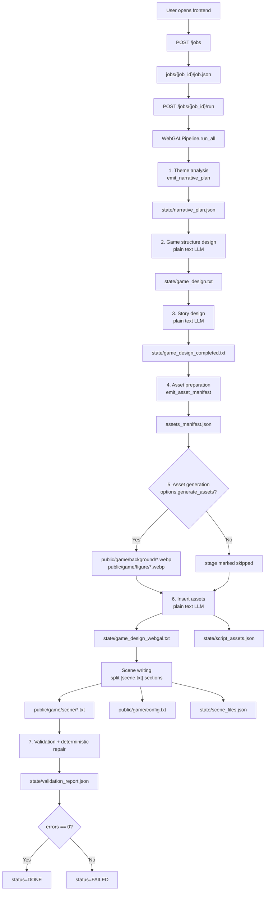

# WebGAL Forge Project Flowchart



## Artifact Layout

```text
jobs/{job_id}/
  job.json
  assets_manifest.json
  state/
    narrative_plan.json
    game_design.txt
    game_design_completed.txt
    game_design_webgal.txt
    script_assets.json
    scene_files.json
    validation_report.json
    llm_traces/
      *.json
      stage_timings.jsonl
  public/game/
    config.txt
    background/*.webp
    figure/*.webp
    scene/*.txt
```

## Key Design Rule

Structured artifacts use backend contracts and schema validation. Long-form script writing stays as text generation. `run_scenes` writes final WebGAL scene files, and validation applies deterministic repairs before reporting remaining errors.
