# WebGAL Forge Project Flowchart

```mermaid
flowchart TD
  U["User opens frontend<br/>http://127.0.0.1:8010"] --> UI["Frontend<br/>frontend/index.html + app.js"]
  UI --> C["POST /jobs<br/>Create job"]
  C --> J["jobs/{job_id}/job.json<br/>status=CREATED"]
  UI --> R["POST /jobs/{job_id}/run<br/>background=true"]

  R --> P["WebGALPipeline.run_all"]

  P --> N1["Phase 1: Narrative<br/>emit_narrative_plan"]
  N1 --> NC["Inject phase context<br/>schema + contract + constraints"]
  NC --> DS1["DeepSeek Chat Completions<br/>function call"]
  DS1 --> NV["Parse function arguments<br/>normalize narrative plan"]
  NV --> NS{"Schema + semantic<br/>validation passed?"}
  NS -- "No" --> NR["Retry with validation errors"]
  NR --> DS1
  NS -- "Yes" --> NW["Write state/narrative_plan.json<br/>legacy planning JSONs"]

  NW --> A1["Phase 2: Assets<br/>emit_asset_manifest"]
  A1 --> AC["Inject asset schema<br/>asset contract + naming/limits"]
  AC --> DS2["DeepSeek function call"]
  DS2 --> AV{"Asset manifest<br/>valid?"}
  AV -- "No" --> AR["Retry with errors"]
  AR --> DS2
  AV -- "Yes" --> AW["Write assets_manifest.json"]
  AW --> AG{"options.generate_assets?"}
  AG -- "Yes" --> AS["Run original WebGAL asset scripts<br/>generate_assets.py<br/>remove_bg.py<br/>make_avatar.py"]
  AG -- "No" --> ASKIP["Skip image generation"]
  AS --> SR
  ASKIP --> SR

  SR["Phase 3: Scenes<br/>emit_scene_batch"] --> SC["Inject scene schema<br/>scene contract + syntax/naming/limits"]
  SC --> DS3["DeepSeek function call<br/>compact scene blueprints"]
  DS3 --> SV{"Scene batch JSON<br/>valid and complete?"}
  SV -- "Yes" --> SW["Render WebGAL .txt files<br/>public/game/scene/*.txt"]
  SV -- "No / JSON truncated" --> SF["Fallback scene generator<br/>derive scene_batch from<br/>narrative_plan + assets_manifest"]
  SF --> SFL["Write state/scene_generation_fallback.json"]
  SFL --> SW
  SW --> SB["Write state/scene_batch.json"]

  SB --> V1["Phase 4: Validation<br/>deterministic validator"]
  V1 --> VC["Check syntax, references,<br/>variables, endings, limits, naming"]
  VC --> VW["Write state/validation_report.json"]
  VW --> VP{"errors == 0?"}

  VP -- "Yes" --> DONE["status=DONE<br/>Artifacts ready"]
  VP -- "No" --> RP["Phase 5: Repair<br/>emit_repair_plan"]
  RP --> RC["Inject repair schema<br/>repair contract + syntax rules"]
  RC --> DS4["DeepSeek function call"]
  DS4 --> RV{"Repair plan valid?"}
  RV -- "No" --> RR["Retry repair plan"]
  RR --> DS4
  RV -- "Yes" --> RA["Apply targeted scene repairs<br/>public/game/scene/*.txt"]
  RA --> RL["Append state/repair_log.json"]
  RL --> V1

  VP -- "Errors remain after 3 cycles" --> FAIL["status=FAILED<br/>error written to job.json"]

  DONE --> FE["Frontend polls GET /jobs/{job_id}<br/>and GET /artifacts"]
  FAIL --> FE
  FE --> PREV["User previews artifacts<br/>narrative_plan, assets_manifest,<br/>scene files, validation report"]
```



## Artifact Layout

```text
jobs/{job_id}/
  job.json
  assets_manifest.json
  state/
    narrative_plan.json
    characters.json
    variables.json
    scene_graph.json
    branch_map.json
    ending_matrix.json
    scene_batch.json
    scene_generation_fallback.json
    validation_report.json
    repair_log.json
  public/game/
    background/
    figure/
    bgm/
    scene/*.txt
```

## Key Design Rule

The LLM proposes structured artifacts through forced function calls. The backend decides whether an artifact is accepted, writes files, runs deterministic validation, and falls back when model output is too long or malformed.
