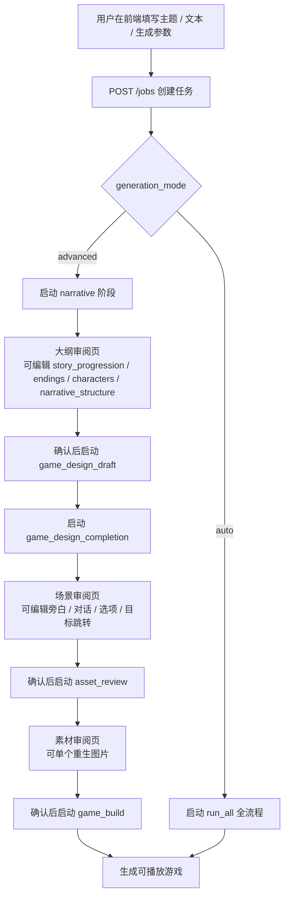
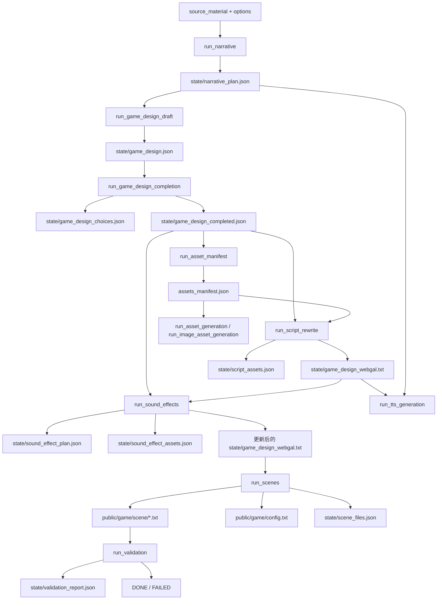

# WebGAL Forge 项目总说明

这份 README 是当前项目的单一权威说明文档。通过这一份文档理解下面这些问题：

- 这个项目到底是干什么的
- 整个系统由哪些层组成
- 一次生成任务从开始到结束会经过哪些阶段
- 每个阶段的输入、输出、子阶段、关键逻辑和失败点是什么
- 前端、后端、WebGAL 运行时、资产脚本分别放在哪里
- `jobs/{job_id}` 目录里每个中间产物是什么意思
- 我想改某个功能时，应该先看哪些文件

如果后续实现发生变化，请优先更新这份 README，再考虑是否同步更新其他辅助文档。

---

## 1. 项目是什么

WebGAL Forge 是一个“从教学文本到可玩互动游戏”的生成系统。用户输入教学主题、原始文本和一组教学参数，系统会自动生成一套可在浏览器中运行的 WebGAL 互动叙事游戏。

它不是单轮 prompt 直接吐出最终脚本的玩具，而是一条多阶段流水线：

1. 先理解原始材料，生成结构化叙事方案
2. 再把叙事方案扩展成场景设计和互动结构
3. 再把场景设计改写成 WebGAL 可执行脚本
4. 再补充图片、音效、TTS 等可选素材
5. 最后拆分成真实场景文件，并执行校验与修复

最终产物是：

- 一套任务目录：`jobs/{job_id}/`
- 一份可播放游戏：`/play/{job_id}/`
- 一组完整中间产物：便于审阅、回放、调试和局部重跑

---

## 2. 一句话理解系统架构

系统由五层组成：

1. `forge_frontend_next/`
   当前主用的 Next.js 生成工作台。负责创建任务、审阅大纲、审阅场景、审阅素材和驱动阶段切换。
2. `webgal_backend/`
   FastAPI 后端，负责任务管理、阶段调度、LLM 调用、素材规划、脚本改写、场景拆分和校验。
3. `asset_scripts/`
   图片后处理和素材生成相关脚本，供后端在素材阶段调用。
4. `src/`、`public/`、`dist/`
   WebGAL 引擎本体。`dist/` 是构建后的静态引擎资源，后端会把它和生成出来的游戏内容拼起来对外播放。
5. `jobs/`
   每次生成任务的运行时工作目录。这里既存最终游戏，也存每个阶段的中间结果和 trace。

---

## 3. 当前推荐使用方式

当前产品有两种生成模式：

- `advanced`
  用户逐阶段审阅和确认：大纲 -> 场景 -> 素材 -> 生成游戏
- `auto`
  用户创建任务后直接全流程自动跑完

当前主流程入口是：

- 创建页：`forge_frontend_next/app/page.tsx`
- 工作台页：`forge_frontend_next/app/jobs/[jobId]/page.tsx`
- 后端入口：`webgal_backend/app.py`
- 流水线调度：`webgal_backend/pipeline.py`

---

## 4. 端到端总流程

### 4.1 产品视角



### 4.2 后端流水线视角



### 4.3 `run_all` 的真实顺序

`WebGALPipeline.run_all()` 当前顺序是：

1. `narrative`
2. `game_design`
3. `asset_manifest`
4. `script_rewrite`
5. `sound_effects`
6. `asset_generation`
7. `scenes`
8. `validation`
9. `DONE`

注意：

- `game_design` 是组合阶段，不是单一步骤
- `asset_generation` 会根据配置决定是否实际生成图片和 TTS
- `run_all` 不经过人工审阅

---

## 5. 阶段总表

| 阶段名 | 入口函数 | 是否组合阶段 | 主要输入 | 主要输出 |
| --- | --- | --- | --- | --- |
| Narrative Planning | `run_narrative` | 否 | `source_material`, `options` | `state/narrative_plan.json` |
| Game Design Draft | `run_game_design_draft` | 否 | `narrative_plan.json` | `state/game_design.json` |
| Game Design Completion | `run_game_design_completion` | 否 | `game_design.json`, `narrative_plan.json` | `state/game_design_choices.json`, `state/game_design_completed.json` |
| Game Design | `run_game_design` | 是 | `narrative_plan.json` | 上述两个阶段的全部输出 |
| Asset Manifest | `run_asset_manifest` | 否 | `narrative_plan.json`, `game_design.json` | `assets_manifest.json` |
| Image Asset Generation | `run_image_asset_generation` | 否 | `assets_manifest.json`, `options.generate_assets` | `public/game/background/*`, `public/game/figure/*` |
| Asset Generation | `run_asset_generation` | 否 | `assets_manifest.json`, `game_design_webgal.txt`, TTS 开关 | 图片 / TTS 资产 |
| Asset Review | `run_asset_review` | 是 | `narrative_plan.json`, `game_design.json` | `assets_manifest.json` + 图片生成结果 |
| Script Rewrite | `run_script_rewrite` | 否 | `game_design_completed.json`, `assets_manifest.json` | `state/game_design_webgal.txt`, `state/script_assets.json` |
| Sound Effects | `run_sound_effects` | 否 | `game_design_completed.json`, `game_design_webgal.txt` | `state/sound_effect_plan.json`, 更新后的脚本 |
| TTS Generation | `run_tts_generation` | 否 | `game_design_webgal.txt`, `narrative_plan.json`, TTS 开关 | `state/tts_manifest.json`, `public/game/vocal/*` |
| Scene Writing | `run_scenes` | 否 | `game_design_webgal.txt` | `public/game/scene/*.txt`, `config.txt`, `scene_files.json` |
| Validation | `run_validation` | 否 | `public/game/scene/*.txt` 等 | `state/validation_report.json` |
| Assets | `run_assets` | 是 | 组合执行 | `asset_manifest + script_rewrite + sound_effects + asset_generation` |
| Game Build | `run_game_build` | 是 | 组合执行 | `script_rewrite + sound_effects + tts + scenes + validation + DONE` |

---

## 6. 各阶段详细说明

## 6.1 Create Job

### 入口

- API：`POST /jobs`
- 实现：`webgal_backend/app.py:create_job`
- 存储：`webgal_backend/storage.py:JobStore.create`

### 输入

- `source_material`
- `options`

### 做什么

1. 校验前端传来的生成参数
2. 创建新的 `job_id`
3. 初始化任务目录
4. 初始化 `job.json`

### 输出

- `jobs/{job_id}/job.json`
- `jobs/{job_id}/state/`
- `jobs/{job_id}/public/game/scene/`
- `jobs/{job_id}/public/game/background/`
- `jobs/{job_id}/public/game/figure/`
- `jobs/{job_id}/public/game/bgm/`

### 关键点

- `job_id` 是 32 位十六进制字符串
- `job.json` 中会记录：
  - `status`
  - `phase`
  - `source_material`
  - `options`
  - `artifacts`
  - `history`

---

## 6.2 Narrative Planning

### 入口

- 函数：`WebGALPipeline.run_narrative`
- API 阶段名：`narrative`

### 输入

- `job["source_material"]`
- `job["options"]`

### 子任务

1. 进入状态：`RUNNING / NARRATIVE_PLANNING`
2. 生成 narrative prompt
3. 调用 LLM 返回结构化 narrative plan
4. 进行 schema 校验
5. 检查和修复 `narrative_structure`
6. 写入 `state/narrative_plan.json`
7. 记录 artifact
8. 进入状态：`NARRATIVE_READY / NARRATIVE_PLANNING`

### 输出

- `state/narrative_plan.json`
- `state/llm_traces/*`
- `state/llm_traces/stage_timings.jsonl`

### 主要结构

`narrative_plan.json` 里最关键的字段是：

- `story_progression`
- `characters`
- `endings`
- `narrative_structure`

其中：

- `story_progression[].strtype`
  当前用于区分 `main` 和 `branch`
- `narrative_structure`
  当前用 Mermaid 文本表示叙事结构

### 失败点

- schema 不合法
- 角色关系引用不存在角色
- `narrative_structure` 引用了不存在的阶段或结局

---

## 6.3 Game Design Draft

### 入口

- 函数：`WebGALPipeline.run_game_design_draft`
- API 阶段名：`game_design_draft`

### 输入

- `state/narrative_plan.json`

### 子任务

1. 构建 `scene_plan`
2. 让 LLM 先生成“纯场景设计文本”
3. 对原始文本做纠错
4. 检查是否覆盖了所有应该出现的 scene / ending
5. 把文本解析成结构化 JSON
6. 保存 `state/game_design.json`

### 输出

- `state/scene_plan.json`
- `state/game_design.json`

### 关键点

这个阶段不直接生成最终可播放脚本，只生成结构化场景草稿。  
当前真实持久化格式已经是 JSON，不再接受旧的 `game_design.txt` 兼容路径。

### `scene_plan.json` 的作用

它是 narrative plan 到场景文件命名之间的桥：

- 每个 `story_progression` 对应哪个 `scene_file`
- 每个结局对应哪个 `ending_*.txt`
- 每个节点属于主线还是分支

---

## 6.4 Game Design Completion

### 入口

- 函数：`WebGALPipeline.run_game_design_completion`
- API 阶段名：`game_design_completion`

### 输入

- `state/narrative_plan.json`
- `state/game_design.json`
- `state/scene_plan.json`

### 子任务

1. 提取当前场景大纲
2. 从 `narrative_structure` 解析可衔接场景对
3. 让 LLM 只生成结构化 choices payload
4. 归一化 choices
5. 保存 `state/game_design_choices.json`
6. 把 choices 合并回 `game_design.json`
7. 生成 `state/game_design_completed.json`
8. 再次做覆盖校验

### 输出

- `state/game_design_choices.json`
- `state/game_design_completed.json`

### 关键点

- 当前分支设计的持久化核心是 JSON，而不是文本插入
- 选项不允许凭空生成不存在的目标场景
- 目标场景必须来自 `narrative_structure` 可衔接关系

---

## 6.5 Game Design 组合阶段

### 入口

- 函数：`WebGALPipeline.run_game_design`
- API 阶段名：`game_design`

### 实际做的事

1. 先跑 `run_game_design_draft`
2. 再跑 `run_game_design_completion`

### 适用场景

- 自动模式
- 需要一步跑完整个场景设计链路时

---

## 6.6 Asset Manifest

### 入口

- 函数：`WebGALPipeline.run_asset_manifest`
- API 阶段名：`asset_manifest`

### 输入

- `state/narrative_plan.json`
- `state/game_design.json`

### 子任务

1. 将结构化场景重新渲染成文本上下文
2. 从 narrative + scene 生成 asset context
3. 生成 `assets_manifest.json`
4. 对 manifest 做 schema 校验和语义校验

### 输出

- `assets_manifest.json`

### 主要内容

`assets_manifest.json` 会列出：

- 背景图
- 角色立绘
- 对应 prompt
- 文件名
- 分辨率
- 可用场景

### 关键点

- 这里是“素材规划”，不是素材生成
- 单个角色卡、场景卡的前端审阅都基于这里

---

## 6.7 Asset Review 组合阶段

### 入口

- 函数：`WebGALPipeline.run_asset_review`
- API 阶段名：`asset_review`

### 实际做的事

1. 跑 `run_asset_manifest`
2. 跑 `run_image_asset_generation`

### 用途

这是当前高级模式中“进入素材审阅页”的主要后端入口。  
它只负责素材规划和图片素材生成，不负责脚本改写和最终建包。

---

## 6.8 Image Asset Generation

### 入口

- 函数：`WebGALPipeline.run_image_asset_generation`

### 输入

- `assets_manifest.json`
- `options.generate_assets`

### 子任务

1. 如果 `generate_assets = false`，记录跳过事件
2. 如果启用，调用 `asset_scripts/` 下脚本生成背景和立绘
3. 写入 `public/game/background/*`
4. 写入 `public/game/figure/*`

### 输出

- `public/game/background/*.webp`
- `public/game/figure/*.webp`
- 对角色立绘还会额外触发去背和头像裁切处理

---

## 6.9 Asset Generation

### 入口

- 函数：`WebGALPipeline.run_asset_generation`
- API 阶段名：`asset_generation`

### 输入

- `assets_manifest.json`
- `options.generate_assets`
- `options.generate_tts` 或 `options.voice_enabled`

### 子任务

1. 判断图片和 TTS 是否开启
2. 如果都关闭，整阶段记为 skipped
3. 如果有任一开启，使用线程池并行跑：
   - 图片资产生成
   - TTS 生成
4. 收集并聚合错误

### 输出

- 图片资产
- 语音资产
- `state/tts_manifest.json`

### 关键点

- 这是自动模式下比较重的阶段
- 它是“可选资产阶段”，不属于最小可运行链路的必要条件

---

## 6.10 Script Rewrite

### 入口

- 函数：`WebGALPipeline.run_script_rewrite`
- API 阶段名：`script_rewrite`

### 输入

- `state/game_design_completed.json`
- `assets_manifest.json`
- `webgal_backend/contracts/syntax.md`

### 子任务

1. 读取素材 manifest
2. 提取背景和立绘文件列表
3. 生成 `state/script_assets.json`
4. 将结构化场景文本改写成 WebGAL 脚本
5. 校验并修复 Scene/Ending header
6. 写入 `state/game_design_webgal.txt`

### 输出

- `state/script_assets.json`
- `state/game_design_webgal.txt`

### 关键点

- 这是“从剧情设计到可执行脚本”的关键桥梁
- 场景头 `Scene:xxx.txt` / `Ending:xxx.txt` 必须保留
- 后续所有阶段都以这个脚本为参考源

---

## 6.11 Sound Effect Planning

### 入口

- 函数：`WebGALPipeline.run_sound_effects`
- API 阶段名：`sound_effects`

### 输入

- `state/game_design_completed.json`
- `state/game_design_webgal.txt`
- `webgal_backend/sound_effect_assets.json`

### 子任务

1. 读取完整剧情文本
2. 读取当前 WebGAL 脚本
3. 读取音效资产表
4. 让 LLM 为剧情锚点规划音效
5. 规范化音效计划
6. 写入 `state/sound_effect_plan.json`
7. 将音效命令插入脚本
8. 复制实际音效文件到游戏目录

### 输出

- `state/sound_effect_assets.json`
- `state/sound_effect_plan.json`
- 更新后的 `state/game_design_webgal.txt`

### 关键点

- 这里规划的是“在哪一行插入什么音效”
- 它不只写计划，还会直接改写脚本

---

## 6.12 TTS Generation

### 入口

- 函数：`WebGALPipeline.run_tts_generation`
- API 阶段名：`tts_generation`

### 输入

- `state/game_design_webgal.txt`
- `state/narrative_plan.json`
- `options.voice_enabled`
- `options.generate_tts`
- `options.voice_preset`

### 子任务

1. 判断 TTS 是否启用
2. 基于角色信息尝试分配 voice
3. 构建 TTS manifest
4. 生成音频
5. 保存 `state/tts_manifest.json`
6. 保存 `public/game/vocal/*.wav`
7. 如果启用状态下存在失败项，整阶段报错

### 输出

- `state/tts_manifest.json`
- `public/game/vocal/*.wav`

### 关键点

- TTS 不直接写剧情，它服务于已有脚本
- TTS 的行选择和行数上限由 `options` 控制

---

## 6.13 Scene Writing

### 入口

- 函数：`WebGALPipeline.run_scenes`
- API 阶段名：`scenes`

### 输入

- `state/game_design_webgal.txt`

### 子任务

1. 把完整 WebGAL 脚本按 `Scene:` / `Ending:` 拆成多个 `.txt`
2. 如果场景头丢失，尝试根据参考文本恢复
3. 写入 `public/game/scene/*.txt`
4. 生成 `state/scene_files.json`
5. 生成 `public/game/config.txt`
6. 拷贝运行时骨架资源到任务目录

### 输出

- `public/game/scene/*.txt`
- `state/scene_files.json`
- `public/game/config.txt`

### 关键点

- 这是“逻辑脚本”到“WebGAL 文件系统结构”的落地步骤
- 后端播放页面会直接读这里的内容

---

## 6.14 Validation and Repair

### 入口

- 函数：`WebGALPipeline.run_validation`
- API 阶段名：`validation`

### 输入

- `public/game/scene/*.txt`
- `assets_manifest.json`
- `narrative_plan.json`
- `state/tts_manifest.json`
- 其他生成资产

### 子任务

1. 遍历所有场景文件
2. 执行确定性修复：
   - mini avatar
   - vocal 参数
   - figure 清理
   - ending 补 `end;`
   - header 恢复后的结构收束
3. 生成校验报告
4. 如果仍有 error，则任务失败

### 输出

- `state/validation_report.json`

### 典型检查项

- `scene_structure`
- `mini_avatar`
- `vocal_args`
- `figure_positions`
- `choice_callbacks`
- `ending_closure`
- `branch_density`
- `template_phrases`

### 阶段结果

- 无错误：`VALIDATION_PASSED`
- 有错误：`VALIDATION_FAILED`

---

## 6.15 Assets 组合阶段

### 入口

- 函数：`WebGALPipeline.run_assets`
- API 阶段名：`assets`

### 实际做的事

1. `run_asset_manifest`
2. `run_script_rewrite`
3. `run_sound_effects`
4. `run_asset_generation`

### 用途

偏向自动化批处理，适合把“素材和脚本相关阶段”打包一起执行。

---

## 6.16 Game Build 组合阶段

### 入口

- 函数：`WebGALPipeline.run_game_build`
- API 阶段名：`game_build`

### 实际做的事

1. `run_script_rewrite`
2. `run_sound_effects`
3. `run_tts_generation`
4. `run_scenes`
5. `run_validation`
6. `DONE`

### 用途

这是当前高级模式中“素材确认后开始生成最终游戏”的主要组合入口。

---

## 7. 阶段状态与 phase 名称

### 7.1 可调用的 phase 名

当前后端支持的 phase 包括：

- `narrative`
- `game_design`
- `game_design_draft`
- `game_design_completion`
- `asset_review`
- `asset_manifest`
- `asset_generation`
- `script_rewrite`
- `sound_effects`
- `sound`
- `tts_generation`
- `tts`
- `assets`
- `game_build`
- `scenes`
- `validation`

其中：

- `sound` 是 `sound_effects` 的别名
- `tts` 是 `tts_generation` 的别名

### 7.2 常见状态

任务常见状态有：

- `CREATED`
- `QUEUED`
- `RUNNING`
- `NARRATIVE_READY`
- `GAME_DESIGN_DRAFT_READY`
- `GAME_DESIGN_READY`
- `ASSET_MANIFEST_READY`
- `ASSET_REVIEW_READY`
- `ASSET_GENERATION_READY`
- `SCRIPT_REWRITE_READY`
- `SOUND_EFFECTS_READY`
- `TTS_READY`
- `SCENES_READY`
- `VALIDATION_PASSED`
- `VALIDATION_FAILED`
- `DONE`
- `FAILED`

`job.json.history` 会持续记录这些状态变化。

---

## 8. 前端是怎么驱动这条链的

## 8.1 创建页

文件：

- `forge_frontend_next/app/page.tsx`

职责：

- 展示输入表单
- 收集 `source_material` 和 `options`
- 选择 `generation_mode`
- 创建任务
- 根据模式决定启动方式

行为：

- `advanced`：
  - 创建任务后只启动 `narrative`
  - 用户在工作台逐步确认
- `auto`：
  - 创建任务后直接调用 `/jobs/{id}/run`
  - 后端自动全链路执行

## 8.2 工作台页

文件：

- `forge_frontend_next/app/jobs/[jobId]/page.tsx`
- `forge_frontend_next/app/jobs/[jobId]/workspace-data.ts`

职责：

- 拉取 job / nodes / asset review 数据
- 审阅和编辑 narrative plan
- 审阅和编辑 scene draft / completed scenes
- 审阅素材和单个重生图片
- 触发各阶段切换

当前页面主要分三个大 tab：

1. `outline`
2. `scenes`
3. `assets`

---

## 9. 后端 API 全景

## 9.1 核心任务 API

| 方法 | 路径 | 用途 |
| --- | --- | --- |
| `GET` | `/health` | 健康检查 |
| `GET` | `/generation-options/schema` | 获取前端参数 schema |
| `POST` | `/jobs` | 创建任务 |
| `GET` | `/jobs` | 列出任务 |
| `GET` | `/jobs/{job_id}` | 查看任务 |
| `GET` | `/jobs/{job_id}/nodes` | 获取节点和场景内容 |
| `PATCH` | `/jobs/{job_id}/artifacts` | 保存可编辑产物 |
| `POST` | `/jobs/{job_id}/run` | 运行全流程 |
| `POST` | `/jobs/{job_id}/phases/{phase}` | 运行单阶段或组合阶段 |

## 9.2 叙事编辑相关 API

| 方法 | 路径 | 用途 |
| --- | --- | --- |
| `POST` | `/jobs/{job_id}/narrative-node` | 新增阶段 / 结局 / 角色节点 |
| `POST` | `/jobs/{job_id}/narrative-structure/sync` | 根据当前大纲同步 Mermaid 流程图 |

## 9.3 素材和产物 API

| 方法 | 路径 | 用途 |
| --- | --- | --- |
| `GET` | `/jobs/{job_id}/assets/review` | 获取素材审阅信息 |
| `POST` | `/jobs/{job_id}/assets/regenerate` | 重生单个图片素材 |
| `GET` | `/jobs/{job_id}/artifacts` | 列出产物路径 |
| `GET` | `/jobs/{job_id}/artifacts/{path}` | 读取具体产物 |

## 9.4 播放相关 API

| 方法 | 路径 | 用途 |
| --- | --- | --- |
| `GET` | `/play/{job_id}/` | 打开游戏 |
| `GET` | `/play/{job_id}/index.html` | 游戏 HTML |
| `GET` | `/play/{job_id}/game/{file_path}` | 读取生成的游戏资源 |
| `GET` | `/play/{job_id}/assets/{file_path}` | 读取引擎资源 |
| `GET` | `/play/{job_id}/static-engine/{file_path}` | 读取静态引擎资源 |

---

## 10. `jobs/{job_id}` 目录详解

一个任务目录通常长这样：

```text
jobs/{job_id}/
  job.json
  assets_manifest.json
  state/
    narrative_plan.json
    scene_plan.json
    game_design.json
    game_design_choices.json
    game_design_completed.json
    game_design_webgal.txt
    script_assets.json
    sound_effect_assets.json
    sound_effect_plan.json
    tts_manifest.json
    scene_files.json
    validation_report.json
    llm_traces/
      *.json
      stage_timings.jsonl
  public/
    game/
      config.txt
      scene/*.txt
      background/*
      figure/*
      vocal/*
      bgm/*
```

### 10.1 根目录文件

- `job.json`
  任务元信息、状态、历史、artifact 映射
- `assets_manifest.json`
  规划好的图片素材清单

### 10.2 `state/`

这是最重要的调试目录，存放所有中间过程产物。

- `narrative_plan.json`
  结构化叙事大纲
- `scene_plan.json`
  场景文件命名与叙事节点映射
- `game_design.json`
  场景设计初稿
- `game_design_choices.json`
  分支与选项补全结果
- `game_design_completed.json`
  合并 choices 后的完整场景设计
- `game_design_webgal.txt`
  改写后的完整 WebGAL 脚本
- `script_assets.json`
  脚本可用素材列表
- `sound_effect_assets.json`
  音效资源表
- `sound_effect_plan.json`
  音效插入计划
- `tts_manifest.json`
  TTS 生成清单和结果
- `scene_files.json`
  最终写出的场景文件路径表
- `validation_report.json`
  校验与修复报告
- `llm_traces/`
  保存 LLM 请求、响应、阶段耗时

### 10.3 `public/game/`

这是最终被 WebGAL 播放器读取的游戏目录。

- `config.txt`
  游戏入口和基础配置
- `scene/*.txt`
  真正可执行的场景文件
- `background/*`
  背景图
- `figure/*`
  立绘
- `vocal/*`
  配音音频
- `bgm/*`
  背景音乐

---

## 11. 项目目录结构详解

```text
.
├─ asset_scripts/
├─ dist/
├─ forge_frontend_next/
├─ jobs/
├─ public/
├─ scripts/
├─ src/
├─ tests/
└─ webgal_backend/
```

### 11.1 `webgal_backend/`

后端核心。

- `app.py`
  FastAPI 入口，定义路由、后台任务、播放入口
- `pipeline.py`
  阶段编排器，定义完整流水线和组合阶段
- `job_options.py`
  前端生成参数的校验和标准化
- `storage.py`
  任务目录和 `job.json` 的读写
- `llm.py`
  LLM 客户端封装
- `prompts.py`
  各阶段 prompt 入口
- `prompting/`
  prompt builder、规则、契约拼装
- `game_design.py`
  `game_design` 结构处理、场景解析、choices 合并等纯逻辑
- `scene_plan.py`
  narrative 到 scene file 的映射生成
- `scene_validation.py`
  场景校验和确定性修复
- `narrative_structure.py`
  Mermaid 结构图修复和同步
- `narrative_nodes.py`
  单独新增阶段 / 角色 / 结局节点的逻辑
- `tts_pipeline.py`
  TTS manifest 和音频生成
- `tts.py`
  TTS 细节实现
- `artifacts.py`
  工作台可见 artifact 元数据定义
- `validators.py`
  schema 与语义校验
- `config.py`
  路径和环境配置
- `generation_limits.py` / `.json`
  生成限制和模型相关上限
- `contracts/`
  schema、语法契约、工具定义

### 11.2 `forge_frontend_next/`

当前主用前端。

- `app/page.tsx`
  创建任务首页
- `app/jobs/[jobId]/page.tsx`
  任务工作台
- `app/jobs/[jobId]/workspace-data.ts`
  工作台的数据解析、序列化和纯函数逻辑
- `app/layout.tsx`
  布局
- `app/globals.css`
  全局样式

### 11.3 `asset_scripts/`

素材脚本。

- `generate_assets.py`
  主图片生成脚本
- `remove_bg.py`
  去背
- `make_avatar.py`
  生成头像或裁切角色小图

### 11.4 `src/` 和 `public/`

WebGAL 引擎源码与静态资源。

- `src/`
  WebGAL React / TypeScript 运行时源码
- `public/`
  引擎默认资源、模板、示例游戏资源

### 11.5 `dist/`

WebGAL 引擎打包产物。  
后端播放时会把这里的静态引擎和 `jobs/{job_id}/public/game/` 拼成实际可玩的游戏。

### 11.6 `jobs/`

运行时任务目录。  
这是最重要的“生成现场”。

### 11.7 `tests/`

当前自动化测试目录。  
目前主要是：

- `test_backend_contracts.py`

它偏向后端合同和关键逻辑回归测试。

### 11.8 `scripts/`

工程辅助脚本，例如启动脚本等。

---

## 12. 参数系统

核心参数定义在 `webgal_backend/job_options.py`。

当前关键字段包括：

- `classroom_topic`
- `grade`
- `difficulty`
- `teacher_goal`
- `student_goal`
- `duration`
- `narrative_mode`
- `character_count`
- `interactive_task_count`
- `voice_enabled`
- `generate_assets`
- `generate_tts`
- `generation_mode`
- `voice_preset`
- `tts_scope`
- `tts_max_lines_per_scene`
- `tts_max_total_lines`
- `allow_missing_assets`
- `output_packages`

几个重要约束：

- `character_count`: 1-8
- `interactive_task_count`: 1-12
- `generation_mode`: `auto` 或 `advanced`
- 如果 `voice_enabled = true`，则 `voice_preset` 必填

---

## 13. 本地运行方式

## 13.1 安装依赖

根目录：

```powershell
npm install --legacy-peer-deps
npm install webgal-parser --legacy-peer-deps
pip install -r requirements.txt
```

前端：

```powershell
cd forge_frontend_next
npm install
```

## 13.2 环境变量

复制 `.env.example` 为 `.env`，至少确认：

```text
DEEPSEEK_API_KEY=...
ARK_API_KEY=...
```

说明：

- `DEEPSEEK_API_KEY`
  LLM 流水线必须
- `ARK_API_KEY`
  只在图片生成开启时必须

## 13.3 构建引擎

```powershell
npm run build
```

构建后会得到 `dist/`。

## 13.4 启动方式

一键启动：

```powershell
.\start_forge_full.bat
```

或者分别启动：

后端：

```powershell
uvicorn webgal_backend.app:app --host 0.0.0.0 --port 8010
```

前端：

```powershell
cd forge_frontend_next
npm run dev
```

常用地址：

- 后端：`http://127.0.0.1:8010`
- 前端：`http://127.0.0.1:3001`
- 播放页：`http://127.0.0.1:8010/play/{job_id}/`

---

## 14. 典型调试路径

## 14.1 大纲有问题

先看：

- `state/narrative_plan.json`
- `state/llm_traces/*narrative*`
- `webgal_backend/prompts.py`
- `webgal_backend/narrative_structure.py`

## 14.2 场景结构不对

先看：

- `state/scene_plan.json`
- `state/game_design.json`
- `state/game_design_choices.json`
- `state/game_design_completed.json`
- `webgal_backend/game_design.py`

## 14.3 WebGAL 脚本不对

先看：

- `state/game_design_webgal.txt`
- `state/script_assets.json`
- `webgal_backend/prompts.py`
- `webgal_backend/contracts/syntax.md`

## 14.4 音效或 TTS 有问题

先看：

- `state/sound_effect_plan.json`
- `state/sound_effect_assets.json`
- `state/tts_manifest.json`
- `public/game/vocal/*`

## 14.5 最终场景文件不对

先看：

- `public/game/scene/*.txt`
- `state/scene_files.json`
- `state/validation_report.json`
- `webgal_backend/scene_validation.py`

---

## 15. 阅读顺序

如果你是第一次接手这个仓库，推荐按这个顺序读：

1. 先读这份 README
2. 看 `webgal_backend/app.py`
   理解系统对外暴露了哪些 API
3. 看 `webgal_backend/pipeline.py`
   理解阶段编排顺序
4. 看 `webgal_backend/game_design.py`
   理解场景设计和 choices 合并逻辑
5. 看 `forge_frontend_next/app/page.tsx`
   理解创建任务时前端传什么参数
6. 看 `forge_frontend_next/app/jobs/[jobId]/page.tsx`
   理解高级模式下用户如何逐阶段控制流程
7. 跑一条完整任务，打开 `jobs/{job_id}/state/`
   按文件顺序看中间产物是怎么演化的

---

## 16. 当前事实与历史遗留

当前有几件事需要特别记住：

1. `game_design` 相关持久化已经切到 JSON
   不再接受旧的 `game_design.txt` / `game_design_completed.txt` 作为主流程输入
2. 当前主前端是 `forge_frontend_next/`
   `forge_frontend/` 是历史遗留静态前端，不是主要维护目标
3. 当前最接近真实实现的文档应该是这份 README
   其他文档只作为辅助参考

---

## 17. 相关辅助文档

- `PROJECT_FLOWCHART.md`
  比 README 更偏简版流程图
- `PROMPT_TO_PLAYABLE_GAME_FLOW.md`
  更偏 prompt / narrative quality 设计思路

如果两者和 README 冲突，以 README 和代码实现为准。
