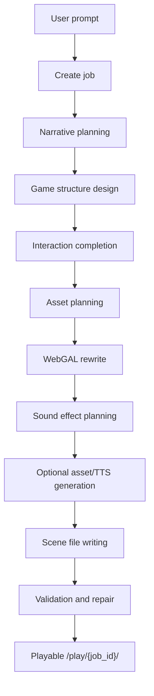

# WebGAL Forge 项目说明

WebGAL Forge 是一个“从课堂叙事文本到可游玩 WebGAL 游戏”的生成系统。它面向语文、文学、历史、人文通识等课堂场景，允许老师或内容设计者输入原始文本、课堂主题、年级、难度、教学目标、角色数量、互动任务数量、是否生成图片和配音等参数，系统自动生成一个可在浏览器中游玩的视觉小说式课堂互动游戏。

这个项目不是单纯的聊天式文本生成器，而是一条多阶段生产流水线：先把原文理解成叙事方案，再设计故事结构和互动任务，之后转换成 WebGAL 脚本，补齐图片、配音、音效等资产，最后进行校验和修复，产出 `/play/{job_id}/` 可访问的游戏。

## 1. 项目定位

### 目标用户

- 课程产品经理：设计课堂互动产品形态、定义生成参数、评估生成质量。
- 教研或内容团队：把文学/历史/故事文本转成课堂可用的互动内容。
- 前端和后端工程师：维护生成平台、WebGAL 播放器、生成流水线和资产生成能力。
- 运营或测试人员：批量验证不同文本、年级、难度和课堂目标下的生成效果。

### 核心价值

- 把“原著/故事/课堂文本”转成“有角色、有选择、有任务、有结局”的互动叙事游戏。
- 让 PM 可以通过参数控制游戏长度、角色数量、互动任务数量、是否配音、是否生成图片等产品变量。
- 让生成过程可追踪：每个任务都会保存中间产物、LLM 调用 trace、最终场景文件和校验报告。
- 复用 WebGAL Engine 作为播放层，减少自研视觉小说运行时的成本。

## 2. 当前产品形态

项目当前包含三层：

1. **生成前端**
   - 旧版静态前端在 `forge_frontend/`，由 FastAPI 后端的 `/` 路由直接服务。
   - 新版 Next.js 前端在 `forge_frontend_next/`，用于承载新的“文境 · AI叙事课堂生成平台”UI。

2. **Forge 后端**
   - 位于 `webgal_backend/`。
   - 使用 FastAPI 提供任务创建、任务运行、任务状态查询、产物访问和游戏播放路由。
   - 负责调度 LLM 生成、资产规划、脚本转换、音效规划、图片/TTS 生成、场景写入和校验修复。

3. **WebGAL 播放器**
   - WebGAL Engine 相关代码位于 `src/`、`public/`、`dist/` 等目录。
   - 构建后生成的 `dist/` 静态资源会被后端用于 `/play/{job_id}/` 的游戏播放。

## 3. 用户使用路径

典型路径如下：

1. PM、老师或内容设计者打开生成前端。
2. 输入课堂主题、原始文本、适用年级、课程难度、教学目标等信息。
3. 配置生成参数，例如游戏时长、叙事模式、角色数量、互动任务数量、是否生成图片、是否启用配音。
4. 前端调用 `POST /jobs` 创建任务。
5. 前端调用 `POST /jobs/{job_id}/run` 启动生成流水线。
6. 后端按阶段生成中间文件和最终 WebGAL 场景。
7. 用户通过 `/play/{job_id}/` 打开可游玩的互动游戏。

## 4. 总体流程

当前推荐参考 `PROMPT_TO_PLAYABLE_GAME_FLOW.md` 中的实际流程：



可以把它理解为三大段：

- **理解与设计**：把原文变成叙事计划，并直接生成游戏结构。
- **转换与补全**：把游戏结构改写成 WebGAL 脚本，并规划图片、配音、音效。
- **落地与质检**：写入场景文件，校验引用关系、分支结构、结局闭环和 WebGAL 语法。

## 5. 后端流水线详解

后端核心调度类是 `webgal_backend/pipeline.py` 中的 `WebGALPipeline`。

### 5.1 Create Job

入口：

- `POST /jobs`

输入：

- `source_material`：用户输入的原始文本。
- `options`：前端传入的生成参数。

关键校验：

- `webgal_backend/job_options.py` 会校验必填参数。
- 如果前端没有传入必要参数，任务不会开始。
- 当前必要参数包括：
  - `classroom_topic`
  - `grade`
  - `difficulty`
  - `teacher_goal`
  - `student_goal`
  - `duration`
  - `narrative_mode`
  - `character_count`
  - `interactive_task_count`
  - `voice_enabled`
  - `generate_assets`

输出：

- `jobs/{job_id}/job.json`
- 初始任务状态和任务 ID。

### 5.2 Narrative Planning

入口方法：

- `run_narrative`

主要文件：

- Prompt：`webgal_backend/prompts.py`
- Schema：`webgal_backend/contracts/schemas/narrative_plan.schema.json`

输入：

- 原始文本 `source_material`
- 课堂参数
- 年级、难度、教学目标、叙事模式
- 游戏时长 `duration`
- 角色数量 `character_count`

功能：

- 识别原文中的核心人物、关系、冲突、场景和教育目标。
- 生成结构化叙事计划。
- 校验角色关系引用，避免出现关系指向不存在角色的问题。

输出：

- `jobs/{job_id}/state/narrative_plan.json`

常见失败：

- 某个角色的 `relationship` 引用了不存在的角色 ID。
- 角色数量和关系网没有对齐。
- LLM 输出不符合 `narrative_plan.schema.json`。

### 5.3 Game Structure Design

入口方法：

- `run_game_design`

输入：

- `narrative_plan.json`
- 生成契约参数，例如角色数量、互动任务数量、时长、结局数量、场景数量建议。

功能：

- 生成游戏结构设计。
- 规划章节、节点、互动任务、选择项、分支、结局。
- 根据 `interactive_task_count` 推导互动密度。
- 根据 `duration` 推导建议场景规模。

输出：

- `jobs/{job_id}/state/game_design.txt`
- `jobs/{job_id}/state/game_design_completed.txt`

说明：

- `game_design.txt` 是初稿。
- `game_design_completed.txt` 是经过补全和格式修正后的版本，后续阶段主要依赖它。

### 5.5 Asset Planning

入口方法：

- `run_asset_manifest`

输入：

- `narrative_plan.json`
- `game_design.txt`

功能：

- 规划游戏所需的角色立绘、背景图、音频、其他资源。
- 建立资产 ID 和后续脚本引用之间的约定。

输出：

- `jobs/{job_id}/assets_manifest.json`

### 5.6 WebGAL Rewrite

入口方法：

- `run_script_rewrite`

输入：

- `game_design_completed.txt`
- `assets_manifest.json`
- WebGAL 语法说明

功能：

- 将游戏结构设计改写成 WebGAL 可执行脚本。
- 将角色、背景、音频、选择项、跳转、分支等写成 WebGAL 命令。
- 生成脚本资产引用表。

输出：

- `jobs/{job_id}/state/game_design_webgal.txt`
- `jobs/{job_id}/state/script_assets.json`

### 5.7 Sound Effect Planning

入口方法：

- `run_sound_effects`

输入：

- `game_design_completed.txt`
- `game_design_webgal.txt`
- `webgal_backend/sound_effect_assets.json`

功能：

- 根据剧情节点规划音效插入位置。
- 将合适的音效命令插入 WebGAL 脚本。
- 将需要的音效文件复制到游戏产物目录。

输出：

- `jobs/{job_id}/state/sound_effect_assets.json`
- `jobs/{job_id}/state/sound_effect_plan.json`
- 更新后的 `game_design_webgal.txt`

### 5.8 Optional Asset / TTS Generation

入口方法：

- `run_asset_generation`

输入：

- `assets_manifest.json`
- `game_design_webgal.txt`
- `narrative_plan.json`
- 前端传入的 `generate_assets`
- 前端传入的 `voice_enabled` 或 `generate_tts`

功能：

- 如果 `generate_assets = true`，调用图片生成脚本生成背景和角色图。
- 如果 `voice_enabled = true` 或 `generate_tts = true`，生成角色语音。
- 如果二者都关闭，则该阶段会记录为跳过。

输出：

- 图片资源：`jobs/{job_id}/public/game/background/`、`figure/` 等。
- 语音资源：`jobs/{job_id}/public/game/vocal/`
- TTS 清单：`jobs/{job_id}/state/tts_manifest.json`

说明：

- 图片生成依赖 ARK API。
- TTS 配置目前仍会读取一部分 `generation_limits.json` 中的模型和音色配置，但是否启用 TTS 已由前端参数控制。

### 5.9 Scene File Writing

入口方法：

- `run_scenes`

输入：

- `game_design_webgal.txt`

功能：

- 将完整 WebGAL 脚本拆分为多个场景文件。
- 生成 WebGAL 所需的 `config.txt`。
- 复制模板、动画、热点配置等基础资源。

输出：

- `jobs/{job_id}/public/game/config.txt`
- `jobs/{job_id}/public/game/scene/*.txt`
- `jobs/{job_id}/state/scene_files.json`

### 5.10 Validation and Repair

入口方法：

- `run_validation`

主要文件：

- `webgal_backend/scene_validation.py`

输入：

- `public/game/scene/*.txt`
- `assets_manifest.json`
- `narrative_plan.json`

功能：

- 校验 WebGAL 场景文件的结构和引用。
- 检查立绘、背景、语音、音效、跳转目标是否存在。
- 检查选择项、分支密度、结局闭环。
- 自动修复部分格式问题。

输出：

- `jobs/{job_id}/state/validation_report.json`
- 最终任务状态：`VALIDATION_PASSED` 或 `VALIDATION_FAILED`

## 6. 任务产物结构

每次生成都会创建一个任务目录：

```text
jobs/{job_id}/
  job.json
  assets_manifest.json
  state/
    narrative_plan.json
    game_design.txt
    game_design_completed.txt
    script_assets.json
    game_design_webgal.txt
    sound_effect_plan.json
    sound_effect_assets.json
    scene_files.json
    tts_manifest.json
    validation_report.json
    llm_traces/
      0001_emit_narrative_plan.json
      0002_game_design_text.json
      stage_timings.jsonl
  public/
    game/
      config.txt
      scene/
        *.txt
      background/
      figure/
      vocal/
      animation/
      template/
```

其中：

- `state/` 保存中间过程，是排查生成问题最重要的目录。
- `llm_traces/` 保存 LLM 调用输入输出，适合调 prompt、复盘失败原因。
- `public/game/` 是最终给 WebGAL 播放器读取的游戏内容。

## 7. 主要目录结构

```text
.
  webgal_backend/              # FastAPI 后端和生成流水线
    app.py                     # API 路由、播放路由、任务入口
    pipeline.py                # 多阶段生成调度
    prompts.py                 # 各阶段 LLM prompt
    job_options.py             # 前端生成参数校验
    scene_validation.py        # 场景校验和修复
    contracts/                 # JSON Schema 和结构化契约

  forge_frontend/              # 旧版静态生成前端
  forge_frontend_next/         # 新版 Next.js 生成前端

  asset_scripts/               # 图片等资产生成脚本
  scripts/                     # 启动脚本和辅助脚本
  jobs/                        # 每次生成任务的运行产物

  src/                         # WebGAL Engine 前端源码
  public/                      # WebGAL Engine 公共资源
  dist/                        # npm run build 后的播放器静态资源

  PROMPT_TO_PLAYABLE_GAME_FLOW.md  # 当前推荐的生成流程说明
  PROJECT_FLOWCHART.md             # 较早的项目流程说明，部分内容可能落后于实际实现
  start_forge_full.bat             # 一键启动前后端脚本
```

## 8. API 概览

常用接口：

| 方法 | 路径 | 用途 |
| --- | --- | --- |
| `GET` | `/health` | 后端健康检查 |
| `GET` | `/` | 旧版静态前端 |
| `POST` | `/jobs` | 创建生成任务 |
| `GET` | `/jobs` | 查看任务列表 |
| `GET` | `/jobs/{job_id}` | 查看单个任务状态 |
| `POST` | `/jobs/{job_id}/run` | 启动完整生成流水线 |
| `POST` | `/jobs/{job_id}/phases/{phase}` | 单独运行某个阶段 |
| `GET` | `/jobs/{job_id}/artifacts` | 查看任务产物 |
| `GET` | `/jobs/{job_id}/artifacts/{path}` | 下载或查看具体产物 |
| `GET` | `/play/{job_id}/` | 打开可游玩的游戏 |

## 9. 前端生成参数

当前后端要求前端显式传入核心生成参数。重要参数包括：

| 参数 | 含义 |
| --- | --- |
| `classroom_topic` | 课堂主题 |
| `grade` | 适用年级 |
| `difficulty` | 学习难度 |
| `teacher_goal` | 教师教学目标 |
| `student_goal` | 学生学习目标 |
| `duration` | 目标游玩时长 |
| `narrative_mode` | 叙事模式 |
| `character_count` | AI 角色数量 |
| `interactive_task_count` | 互动任务数量 |
| `voice_enabled` | 是否启用角色配音 |
| `generate_assets` | 是否生成图片资产 |

其中 `duration` 会影响建议场景数量，`interactive_task_count` 会影响互动密度和结局数量，`character_count` 会影响叙事规划阶段的角色设计约束。

## 10. 启动方式

### 10.1 安装依赖

根目录安装 WebGAL Engine 依赖：

```bash
npm install --legacy-peer-deps
npm install webgal-parser --legacy-peer-deps
```

安装 Python 依赖：

```bash
pip install -r requirements.txt
```

安装新版生成前端依赖：

```bash
cd forge_frontend_next
npm install
```

### 10.2 配置环境变量

复制 `.env.example` 为 `.env`，并根据需要配置：

```text
DEEPSEEK_API_KEY=...
ARK_API_KEY=...
```

说明：

- `DEEPSEEK_API_KEY` 是 LLM 生成流水线必需的。
- `ARK_API_KEY` 只在启用图片生成时需要。

### 10.3 构建 WebGAL 播放器

```bash
npm run build
```

构建完成后，`dist/` 会作为游戏播放静态资源被后端使用。

### 10.4 一键启动前后端

在项目根目录运行：

```powershell
.\start_forge_full.bat
```

该脚本会同时启动：

- 后端：`http://127.0.0.1:8010`
- 新版前端：`http://127.0.0.1:3001`

脚本会在同一个终端持续输出前后端日志。需要停止服务时，在该终端按 `Ctrl+C`。

## 11. 关键实现细节

### 11.1 生成契约

`webgal_backend/prompts.py` 中的 `_generation_contract(options)` 会把前端参数整理成后续 prompt 使用的生成契约。

目前它会处理：

- 游戏时长
- 角色数量
- 互动任务数量
- 建议场景数量
- 选项数量
- 结局数量
- 配音开关
- 图片生成开关

其中叙事规划 prompt 中会明确要求：

- 根据目标游玩时长计算原著保留比例。
- 本次游戏时长为前端传入的 `duration`。
- 角色数量为前端传入的 `character_count`。

### 11.2 参数来源

项目早期有部分参数来自 `generation_limits.json`。当前方向是：

- 产品控制项尽量由前端 `options` 显式传入。
- 如果前端没有传入必要参数，后端直接拒绝启动任务。
- `generation_limits.json` 更适合保留为系统上限、模型配置、默认安全边界，而不是 PM 可调参数的主要来源。

### 11.3 LLM Trace

每次 LLM 调用都会尽量保存 trace，例如：

```text
jobs/{job_id}/state/llm_traces/
```

这对 PM 和工程团队都很重要：

- PM 可以看到某次生成为什么偏离预期。
- Prompt 工程可以复盘输入、输出和失败原因。
- 后端可以基于 trace 做自动重试、错误归因和质量评估。

## 12. 当前质量规则

项目目前重点关注这些质量规则：

- 角色关系必须引用真实存在的角色。
- 角色不能和自己建立关系。
- WebGAL 场景跳转目标必须存在。
- 选择项需要有有效目标。
- 分支不能过薄，结局不能只靠单次选择直接跳达。
- 场景文件需要符合 WebGAL 基础语法。
- 角色立绘、背景、语音、音效引用需要能在产物目录中找到。
- 输出文本应避免明显的模板词，例如“玩家”“节点”“分支”“选项A”等破坏沉浸感的字样。

这些规则主要由 schema 校验、语义校验和 `scene_validation.py` 共同承担。

## 13. 已知风险和注意事项

### 13.1 文档和实际实现可能不完全同步

`PROMPT_TO_PLAYABLE_GAME_FLOW.md` 更接近当前后端实际流程。`PROJECT_FLOWCHART.md` 是较早版本，部分阶段顺序和命名可能已经落后。

### 13.2 生成质量依赖 Prompt 稳定性

当前系统有较多阶段依赖 LLM 输出。虽然有 schema、重试和修复，但仍可能出现：

- 角色 ID 不一致。
- 分支跳转不完整。
- 教学目标表达不够自然。
- 互动任务和剧情融合不足。
- 产物格式符合语法但体验不够好。

### 13.3 前端和后端参数契约需要持续对齐

新版前端已经承载更多产品参数。后续每增加一个 PM 可调参数，都需要同时确认：

- 前端是否展示。
- `POST /jobs` 是否传入。
- `job_options.py` 是否校验。
- `prompts.py` 是否使用。
- `pipeline.py` 后续阶段是否需要读取。

### 13.4 资产生成成本和时延较高

图片生成、TTS 生成会显著增加任务耗时，也依赖外部 API 的稳定性。产品上需要明确：

- 哪些场景默认启用资产生成。
- 是否需要“快速预览模式”。
- 失败后是否允许只生成无图无配音版本。

## 14. 下一步优化方向

### 产品体验

- 增加“快速生成”和“高质量生成”两种模式。
- 在前端显示每个阶段的实时进度，而不仅是任务状态。
- 增加生成参数预设，例如小学低年级、初中文学赏析、高中议论文阅读。
- 增加生成前的“内容风险提示”和“预计耗时提示”。
- 支持生成后局部重写，例如只重写角色、只重写互动任务、只重写结局。

### PM 可控性

- 把角色数量、互动任务数量、游戏时长、叙事模式和资产开关统一成清晰的“生成契约”面板。
- 增加每个参数对结果影响的说明，例如时长如何影响场景数、互动任务数如何影响分支密度。
- 增加生成结果评分维度，例如教学目标命中、剧情完整度、互动有效性、WebGAL 可玩性。

### 生成质量

- 强化 narrative plan 阶段的角色 ID 约束，减少关系引用错误。
- 将互动任务设计从“数量满足”升级为“教学目标驱动”。
- 对结局进行教学意义检查，避免结局只是在剧情上收束、没有学习反馈。
- 增加自动评审阶段，让模型对最终脚本做一次体验侧检查。

### 工程架构

- 将各阶段输入输出契约进一步标准化，减少文本中间态。
- 为关键阶段增加单元测试和样例回归测试。
- 将 `generation_limits.json` 的职责收敛为系统限制和模型配置。
- 增加任务取消、失败重试、阶段重跑和断点续跑能力。
- 对 `jobs/` 目录做归档和清理策略，避免长期运行后产物堆积。

### 前端和可观测性

- 在 Next.js 前端增加任务详情页，展示每个阶段的产物和失败原因。
- 给 PM 增加“查看 Prompt Trace”的调试入口。
- 增加日志面板和错误解释，把后端异常翻译成更容易理解的产品语言。
- 增加生成结果预览、下载、复制分享链接等能力。

## 15. 新 PM 快速上手建议

建议按以下顺序理解项目：

1. 先看本 README，理解项目定位和整体流程。
2. 再看 `PROMPT_TO_PLAYABLE_GAME_FLOW.md`，理解当前后端流水线。
3. 打开 `forge_frontend_next/`，理解用户实际填写哪些参数。
4. 打开 `webgal_backend/job_options.py`，确认哪些参数是后端必需的。
5. 打开 `webgal_backend/prompts.py`，理解 narrative plan 如何直接进入 game design，以及参数如何影响生成内容。
6. 跑一次完整生成，重点查看 `jobs/{job_id}/state/` 下的中间产物。
7. 打开 `/play/{job_id}/`，从玩家视角评估最终体验。

如果只关注产品决策，最值得盯住的是三件事：

- 参数是否真的影响了生成结果。
- 互动任务是否服务教学目标，而不是只制造选择按钮。
- 最终 WebGAL 游戏是否能稳定播放，并且在课堂上有明确使用价值。

