# 全部25张表与整体逻辑

范围：现有认证5表 + 本次方案20张新业务表。新增部分以01–03、06–07 SQL和已核对的认证schema为依据；可选04只补字段，不增加表。

完整可编辑ER源文件：[OVERALL_ER.mmd](OVERALL_ER.mmd)。下方总图只选关键字段，不省略任何表或已声明外键；字段类型省略长度和collation，精确定义以SQL为准。完整字段见[DATA_DICTIONARY.md](DATA_DICTIONARY.md)。

## 1. 先按职责读

| 领域 | 表 | 负责回答什么 |
|---|---|---|
| 账号身份（已有） | users | 这个人是谁，所有业务归属最终指向谁 |
| 登录方式（已有） | accounts | 他通过哪个邮箱/微信身份登录，同一人可以有多种方式 |
| 登录会话（已有） | auth_sessions | 这一次登录是否仍有效 |
| 验证过程（已有） | verification_codes | 某个邮箱的验证码是否有效、已使用、尝试过多少次 |
| 结构管理（已有） | _prisma_migrations | 数据库执行过哪些Prisma迁移，与产品业务无直接关系 |
| 作品 | games | 这部作品是什么、属于谁、当前展示哪一版 |
| 生成过程 | generation_jobs | AI任务正在做什么、是否失败、产物在哪里 |
| 任务历史 | generation_job_events | 任务何时进入哪个状态、失败原因是什么 |
| 发布快照 | game_versions | 某次构建使用哪份草稿、哪个引擎版本、审核如何 |
| 素材 | assets | 这项素材叫什么、是什么类型、谁拥有、来源与授权是什么 |
| 实际文件 | asset_files | 素材的某一修订/变体具体存在哪里、文件大小和哈希是什么 |
| 发布引用 | asset_usages | 这一版游戏的每条资源路径对应哪个确切文件 |
| 草稿引用 | draft_asset_usages | 当前任务草稿的资源路径正在引用哪个确切文件 |
| 社区互动 | game_likes、game_favorites | 谁对哪个作品点赞、收藏；数量可以重新统计 |
| 商品 | products | 现在卖哪个额度包、现价和权益是什么 |
| 购买合同信息 | purchase_orders | 某人当时买了什么、应付多少、是否已支付并到账 |
| 收款过程 | payment_attempts | 每次渠道下单结果、微信交易号、真实付款及退款金额 |
| 通知接收 | payment_notifications | 哪条可信回调已处理，重复通知如何去重 |
| 退款 | refunds | 哪笔收款正在退多少、渠道是否确认完成 |
| 已发额度 | entitlement_grants | 某笔订单发了多少额度、可用/冻结/消费/撤销各多少 |
| 操作冻结 | credit_reservations | 为某一次生成操作暂时占用了多少额度 |
| 批次分摊 | credit_allocations | 这次操作的额度分别来自哪些购买批次 |
| 额度历史 | credit_ledger | 每一次额度变化的原因、变化量与变化后的余额 |
| 可靠异步执行 | outbox_events | 哪个后续动作已经承诺执行、是否成功、是否需要重试 |

## 2. 完整ER图

```mermaid
erDiagram
    users {
        varchar id PK
        varchar email UK
        varchar nickname
    }
    accounts {
        varchar id PK
        varchar user_id FK
        enum provider
        varchar provider_account_id
    }
    auth_sessions {
        varchar id PK
        varchar user_id FK
        varchar token_hash UK
        datetime expires_at
    }
    verification_codes {
        varchar id PK
        varchar email
        varchar code_hash
        datetime consumed_at
    }
    _prisma_migrations {
        varchar id PK
        varchar migration_name
        datetime finished_at
    }
    games {
        char id PK
        varchar owner_user_id FK
        char current_version_id FK
        char cover_file_id FK
        varchar title
    }
    generation_jobs {
        char id PK
        char game_id FK
        varchar owner_user_id FK
        enum status
        bigint draft_revision
    }
    game_versions {
        char id PK
        char game_id FK
        char source_job_id FK
        varchar reviewed_by_user_id FK
        int version_no
    }
    assets {
        char id PK
        varchar owner_user_id FK
        char source_job_id FK
        enum kind
    }
    asset_files {
        char id PK
        char asset_id FK
        int revision
        varchar variant
        varchar object_key
    }
    asset_usages {
        char game_version_id PK,FK
        varchar logical_path PK
        char asset_file_id FK
    }
    generation_job_events {
        bigint id PK
        char job_id FK
        varchar status
        varchar phase
        text message
    }
    draft_asset_usages {
        char job_id PK,FK
        varchar logical_path PK
        char asset_file_id FK
        varchar user_id FK
    }
    game_likes {
        char game_id PK,FK
        varchar user_id PK,FK
    }
    game_favorites {
        char game_id PK,FK
        varchar user_id PK,FK
    }
    products {
        char id PK
        varchar sku UK
        bigint price_fen
        json benefit_json
    }
    purchase_orders {
        char id PK
        varchar user_id FK
        char product_id FK
        char paid_attempt_id FK
        json product_snapshot
    }
    payment_attempts {
        char id PK
        char order_id FK
        varchar out_trade_no
        varchar transaction_id
        enum status
    }
    payment_notifications {
        char id PK
        char payment_attempt_id FK
        varchar notification_id
        enum status
    }
    refunds {
        char id PK
        char order_id FK
        char payment_attempt_id FK
        varchar requested_by_user_id FK
        bigint amount_fen
    }
    entitlement_grants {
        char id PK
        char order_id FK
        varchar user_id FK
        char target_game_id FK
        bigint units_available
    }
    credit_reservations {
        char id PK
        varchar user_id FK
        char job_id FK
        varchar operation_key
        bigint units
    }
    credit_allocations {
        char reservation_id PK,FK
        char grant_id PK,FK
        varchar user_id FK
        bigint units
    }
    credit_ledger {
        bigint id PK
        char grant_id FK
        char reservation_id FK
        varchar user_id FK
        enum action
    }
    outbox_events {
        char id PK
        varchar event_key UK
        varchar event_type
        varchar aggregate_id
        enum status
    }

    users ||--o{ accounts : "绑定登录方式"
    users ||--o{ auth_sessions : "登录会话"
    users ||--o{ games : "拥有作品"
    games ||--o{ generation_jobs : "作品及作者一致"
    generation_jobs ||--o{ generation_job_events : "状态与错误历史"
    games ||--o{ game_versions : "历史版本"
    generation_jobs ||--o{ game_versions : "版本来源且作品一致"
    users |o--o{ game_versions : "可选审核人"
    game_versions |o--o| games : "当前发布指针"
    users ||--o{ assets : "拥有素材"
    generation_jobs |o--o{ assets : "可选来源且作者一致"
    assets ||--o{ asset_files : "文件修订及变体"
    game_versions ||--o{ asset_usages : "版本路径映射"
    asset_files ||--o{ asset_usages : "引用确切文件"
    generation_jobs ||--o{ draft_asset_usages : "草稿任务"
    asset_files ||--o{ draft_asset_usages : "草稿引用确切文件"
    asset_files |o--o{ games : "可选封面"
    users ||--o{ game_likes : "点赞人"
    games ||--o{ game_likes : "被点赞作品"
    users ||--o{ game_favorites : "收藏人"
    games ||--o{ game_favorites : "被收藏作品"
    users ||--o{ purchase_orders : "购买人"
    products ||--o{ purchase_orders : "购买商品并留快照"
    purchase_orders ||--o{ payment_attempts : "渠道下单尝试"
    payment_attempts |o--o| purchase_orders : "接受的收款指针"
    payment_attempts |o--o{ payment_notifications : "可选匹配付款"
    payment_attempts ||--o{ refunds : "退款且原订单一致"
    users |o--o{ refunds : "可选申请人"
    purchase_orders ||--o{ entitlement_grants : "发放且购买人一致"
    games |o--o{ entitlement_grants : "预留游戏权益目标"
    users ||--o{ credit_reservations : "额度使用人"
    generation_jobs ||--o{ credit_reservations : "收费操作且作者一致"
    credit_reservations ||--o{ credit_allocations : "分摊且用户一致"
    entitlement_grants ||--o{ credit_allocations : "供给且用户一致"
    entitlement_grants ||--o{ credit_ledger : "批次流水且用户一致"
    credit_reservations |o--o{ credit_ledger : "可选关联消费操作"
```



读图：`||`=恰好一个，`o|`/`|o`=零或一个，`o{`=零到多个；PK=主键、FK=参与外键、UK=单列唯一键。复合唯一键以SQL为准，不能因图中没有UK标记就认为字段没有去重约束。

33条连线对应33个外键：认证表2个、业务表31个。一个复合外键只画一条线，标签中“作者/用户/作品一致”说明它同时限制归属。ER中的实线采用统一显示，不在本图额外区分识别/非识别关系；不使用虚线表达“应用逻辑关系”，以免与ER记法混淆。

三个孤立节点是有意保留：

- verification_codes按email验证，注册前用户可能还不存在，因此没有user_id外键；email相同不意味着存在外键。
- _prisma_migrations由Prisma管理，不应与订单、用户等建立业务关系。
- outbox_events用event_type、aggregate_id和payload定位业务对象，是应用层契约，没有跨多个表的多态外键。

另外，退款通知通过resource_no（如out_refund_no）与事件类型匹配refunds，目前没有notification→refunds专用外键；不能把它画成既有数据库约束。需要该直连时可另加nullable refund_id迁移。

## 3. 用户主线：注册和登录

邮箱验证时先写verification_codes；校验成功后按实际注册/登录场景创建或查找users，并建立accounts登录绑定，最后写auth_sessions。验证码也可用于注册前验证或其他用途，不要求一定已有用户。

用户再次登录只建立新会话，不建立新业务用户。作品、素材、订单都用users.id；不要用session_id、邮箱或微信openid作为作品归属键，因为会话会过期、邮箱可能变更、登录方式可能有多个。

## 4. 内容主线：作品 → 任务 → 发布版本

示例：用户创建《海岛探险》。

1. games创建G1，名称《海岛探险》，owner_user_id是该用户，初始私有。
2. generation_jobs创建J1并关联G1，记录参数、阶段、草稿revision和错误。
3. 生成过程中创建背景、角色和语音等assets，以及每项素材的asset_files。
4. 构建出game_versions的V1，source_job_id=J1；asset_usages保存V1中资源路径到具体文件的映射。
5. V1就绪并满足审核/权限条件后，把G1.current_version_id切到V1。
6. 后续编辑生成V2，发布前V1继续在线；发布后改指针，V1仍可追溯。

**作品是长期实体，任务是执行上下文，版本是发布快照。** 点赞收藏属于G1，不因V1换成V2而丢失。生成成功只代表产物完成，不意味着审核通过或作品已公开。

目前同job可以进行多次操作/重试，操作用operation_key区分；不应假设每次点击都必须生成新job。不同job也可以属于同一个game。

games与game_versions之间两条线含义不同：一条是“作品有哪些历史版本”，另一条是“当前选择哪一版”。创建时先有game、当前指针为空，再有job和version，最后填指针，因此循环外键并不要求同时创建两条记录。

## 5. 资源主线：素材 → 文件 → 被版本引用

例如逻辑素材A1“主角立绘”：第一次生成的F1、重生成的F2、F2对应缩略图F3，可以属于同一assets行，但asset_files有不同revision/variant。

V1通过asset_usages引用F1；V2引用F2。重新生成不覆盖F1，因此旧版游戏画面保持不变。一个文件能被多个版本、多个作品引用，复用的授权由应用层检查。

数据库存对象位置、哈希、尺寸和状态；OSS存文件内容。不要把素材BLOB塞进业务表，也不要把会过期的签名URL当永久文件身份。文件id是内部引用，object_key是实际存储位置。

当前asset_usages只覆盖候选/发布版本，不覆盖正在编辑的全部草稿。首期只软删，自动物理清理保持关闭，等草稿引用可以完整追踪后再启用。

## 6. 支付主线：商品 → 订单 → 实收 → 额度

以“示例额度包：10个积分，示例价格100分”为例，这只是说明数据流，不是推荐售价。

1. products定义SKU、价格、10个积分的权益配置。
2. 用户点击购买，purchase_orders创建O1，冻结当时的商品、价格、权益和退款规则快照；以后SKU改价不改变O1。
3. payment_attempts创建P1，再调用微信下单；out_trade_no标识这一次渠道下单。
4. 验证支付回调后，payment_notifications登记通知；payment_attempts保存真实交易号和成功金额。
5. O1.paid_attempt_id选择P1作为订单接受的收款，O1置PAID；同事务写发放事件outbox。
6. 履约worker创建entitlement_grants的E1（10个可用积分）、追加GRANT流水，再把订单履约标FULFILLED。

**付款是钱的状态，grant是用户可用服务额度的状态。** 已支付但发放失败时要补发，不能让用户重新付一次。通知是传递证据的消息，不是购买订单，更不是余额本身。

订单和payment_attempts也有两条关系：一个订单可以经历多次明确关闭/失败后的支付尝试，但只能选择一笔正常实收用于履约。意外重复实收要保留证据并退回，不能删掉第二笔记录。

## 7. 消费主线：额度批次 → 冻结 → 扣除/释放

用户拥有两笔购买得到的额度批次E1和E2。一次生成操作需要3积分，而E1只剩1积分、E2剩5积分：

- credit_reservations创建R1：job_id=J1、operation_key=此次操作、units=3。
- credit_allocations创建两行：R1从E1取1分、从E2取2分。
- entitlement_grants相应地available减少、reserved增加；credit_ledger记两条RESERVE流水。
- 成功时把这3分从reserved转consumed，写CAPTURE，R1转CAPTURED。
- 确定失败且任务不会继续产出时转回available，写RELEASE，R1转RELEASED。

**reservation回答“这次占了多少”，allocation回答“从哪几笔购买里占”，ledger回答“额度为什么改变”。** 三者不是重复记录。

用户余额是有效grant的可用额度之和。首期不另加一张可随意改数的钱包表。批次满足：

```text
已发额度 = 可用 + 冻结 + 已消费 + 已撤销
```

买包与生成不是一对一：一个订单的额度可供多个job使用，一个job的某次操作也可能用多个订单的额度。因此purchase_orders不直接绑定job_id，而通过grant→allocation→reservation→job形成可追踪关系。

## 8. 退款主线：原付款 → 退款 → 对应权益回收

退款必须关联实际payment_attempt，而不仅是user。用户申请退款后，refunds记录申请，付款表预占可退款金额，对应grant暂停使用；渠道确认成功后再累计退款金额、撤销额度并写流水。

首期建议只开放未消费、未冻结整包的全额退款，部分使用转人工处理；具体规则上线前确认。退款申请不等于退款成功，UNKNOWN保持占用并查询原退款号。

若退的是额外重复付款，只处理这笔多收的钱，不撤销正常付款发放的额度。

## 9. 社区与可靠执行两条辅助主线

点赞收藏：users与games是多对多，经game_likes/game_favorites连接。每用户每作品最多一条同类关系；games上的计数只服务展示，关系记录才是事实。换版本不重置互动，换可见性时重新检查访问权限。

可靠执行：在“付款确认”和“承诺发放额度”之间，或者“冻结额度”和“承诺启动生成”之间，用同一数据库事务写outbox。worker可以失败后重试，每个消费者按领域唯一键去重。outbox保存待做的动作及重试状态，不替代订单、额度或任务本身。

## 10. 哪些关系数据库保证，哪些靠服务

| 规则 | 保障方式 |
|---|---|
| job属于其game的作者 | `(game_id,owner_user_id)`复合外键 |
| version来源job属于同一game | `(source_job_id,game_id)`复合外键 |
| game当前版本确实属于自己 | `(current_version_id,id)`复合外键 |
| grant属于原订单购买人 | `(order_id,user_id)`复合外键 |
| 不能消费其他人的job/额度 | reservation、allocation的复合外键 |
| 同用户同作品不重复点赞收藏 | 复合主键 |
| 同订单同权益不重复发放 | `(order_id,benefit_key)`唯一键 |
| 相同收费操作不重复冻结 | `(job_id,operation_key)`唯一键及active_job_id唯一键 |
| 只有可见作品能被游玩、点赞 | 应用鉴权；外键不会检查可见性 |
| 发布版本已READY、审核通过 | 发布事务校验；外键只检查身份关系 |
| 用户有权复用素材或将其设为封面 | 应用授权；文件存在不等于有使用权 |
| 金额正确、额度守恒、失败只退一次 | 服务端金额校验、行锁、状态机、同事务流水 |
| outbox事件实际执行且只产生一次业务效果 | 重试调度+幂等消费；仅建表无法实现 |

## 11. 实施时抓住四个业务中心

1. **users：身份中心。** 所有业务最终归属于真实用户，账号绑定与会话仅用于认证。
2. **games：内容中心。** job生产内容，version冻结内容，asset_file提供内容，点赞收藏围绕作品。
3. **purchase_orders：交易中心。** product决定卖什么，payment记录收款，refund记录退回，grant承接服务权益。
4. **entitlement_grants：额度中心。** reservation控制占用，allocation保留来源，ledger保留变化。

阅读顺序建议：先看games→jobs→versions，再看assets→files→usages，最后看orders→payments→grants→reservations。不要从所有字段逐列背起；先明确每张表在记录“谁、什么实体、哪次过程、哪份快照、哪笔事实”。
