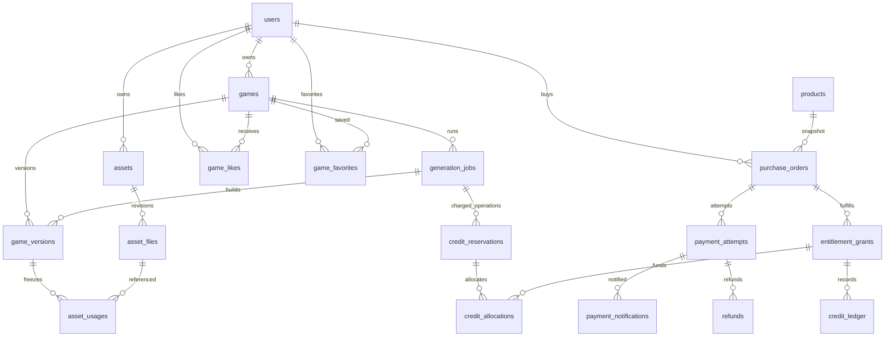

# NarrativeOS：支付、作品生态与素材库实施方案

## 1. 结论与本次决策

现有表能够承担登录与账号绑定，但还没有内容、生成执行、支付履约等业务数据。建议继续使用已有 MySQL，不为这轮需求再引入另一种数据库。

用户已确认：

1. 首期卖生成次数／积分包。
2. 所有功能都绑定正式登录用户，统一使用 `users.id`。业务表直接存 `owner_user_id` 或 `user_id`，不增加邀请码身份桥接表。

首期建议采用固定额度包、单商品订单、CNY、微信 Native 支付；暂不做购物车、充值提现、自动续费、付费解锁作品和创作者分账。产品枚举中的会员及游戏访问仅是扩展接口，不等于这些功能已实现，后端必须拒绝尚未实现的商品类型。

额度单位需要在上线前固定：可以是“1 次生成 = 1 单位”，也可以按长度/素材量报价扣不同积分。**不把人民币金额当额度，不使用浮点数计价，不信任前端传来的价格。** 建议首期展示明确的固定报价和成功标准，复杂动态计价后续再做。

## 2. 已核实的现状与未知项

| 依据 | 已核实事实 | 对设计的影响 |
|---|---|---|
| PDF 第 1–2 页，已抽取文字并逐页查看 | 仅 `_prisma_migrations`、`accounts`、`auth_sessions`、`users`、`verification_codes` | 新增业务域，不重建认证表 |
| PDF 的 `users` | ID 为 varchar(191)；有 email、验证时间、昵称、头像、创建/修改时间、密码哈希 | 不改用户主键类型，不重复添加已有字段 |
| 本地 `linchangWeb/prisma/schema.prisma` 及初始 migration | datasource=mysql，认证表默认 `utf8mb4_unicode_ci`，账号与会话关联 users；依赖 Prisma 6.16.2 范围 | 与现有迁移管理保持一致；PDF 没展示外键，不能据此说线上没有外键 |
| `webgal_backend/storage.py:JobStore` | job_id 仍是 uuid4.hex；启用数据库开关后，状态、参数、产物索引和 revision 存 generation_jobs，状态历史存 generation_job_events | job目录只保存大型产物；文件模式仅作未启用数据库时的兼容路径 |
| `webgal_backend/auth.py` | 当前同时支持 SSO 和邀请码身份 | 新入口必须强制 SSO；旧邀请码任务需要认领迁移，不能冒充 users.id |
| `webgal_backend/oss_storage.py` | 当前上传 key 由 job/category/filename 组成，并构造固定杭州域名 | 引入文件 revision、真实 region/endpoint 与不可变 key |
| `webgal_backend/pipeline.py` | 有多个 `*_READY`、验证阶段等状态；上传 URL 附随机查询参数 | 不把中间完成状态全映射为成功；URL 查询参数不能冻结被覆盖的对象内容 |
| `webgal_backend/app.py` 的播放/草稿文件处理器 | 检查路径和文件存在，但这些处理器本身未调用任务归属检查 | 首期要求登录，必须保护所有播放、素材、草稿和下载路径 |
| `wechatpay_native/service.py`、`notifications.py` | 已有 Native 下单、查单、关单与支付通知验签/解密/金额检查的独立模块 | 复用渠道能力，新增订单持久化、履约、退款、补偿；现有模块尚不是完整支付业务系统 |

没有读取数据库凭据，也没有连接线上库。线上 MySQL 版本、collation、外键、数据量、重复数据、OSS ACL、CDN 配置、已有历史交易均未核实。PDF 是结构快照，不代表已部署业务功能或完整运行约束。

过去曾讨论邀请码桥接和 9 表草案，但当前分支不存在那份历史 SQL；本方案以本次 PDF 和“全量登录”的最新决定为准。若其他分支/环境已经执行过旧草案，预检会发现冲突，应编写差异迁移，不可叠加创建两套同名表。

## 3. 完整数据关系



`outbox_events` 是通用事务事件表：在保存订单支付成功、创建待执行任务、请求退款等业务事务中一起写事件，由后台消费者可靠执行。没有多态外键，必须由服务定义 event_type、载荷 schema 和版本。

三个关键 ID：

- `game_id`：用户看到的“这部作品”，长久不变；点赞、收藏、作品详情都关联它。
- `job_id`：一次创作任务及其执行上下文；同作品可以有多个 job；现有代码同 job 重试/重新生成时，通过 operation_key 和 draft_revision 区分操作。
- `game_version_id`：某次可追溯的发布快照；同 job 可产生多个版本，不能把 `job_id` 当作品版本号。

## 4. 新表分组与首期用途

### 4.1 内容与生成：9 张

| 表 | 首期职责 | 关键字段、索引与规则 |
|---|---|---|
| `games` | 作品列表、详情、发布状态、归属 | title/description/slug、owner_user_id、visibility、current_version_id、cover_file_id、发布时间、deleted_at、乐观锁；用户列表和公开列表复合索引 |
| `generation_jobs` | 任务状态、进度、参数及产物索引 | game_id、owner_user_id、request_key/hash、status/phase、draft/published_revision、lease、heartbeat、错误；同用户请求键唯一 |
| `game_versions` | 不可变发布版本与审核 | version_no、source_job_id、source_draft_revision、engine_version、manifest/hash、build_storage_prefix、review_status；作品内版本号唯一 |
| `assets` | 逻辑素材库 | 用户、类型、来源、源任务、授权、显示名、元信息、软删；生成prompt不作为公开字段 |
| `asset_files` | 实际文件及其衍生版本 | asset_id/revision/variant、provider/bucket/region/key/version_id、内容sha256、MIME、大小、尺寸、时长、上传状态；物理位置哈希唯一 |
| `asset_usages` | 发布版本引用哪些确切文件 | 版本+相对路径唯一，关联某个 asset_file；删除或重生成素材不改变旧发布 |
| `game_likes` | 谁点赞了哪个作品 | `(game_id,user_id)` 主键，防重复点赞 |
| `game_favorites` | 谁收藏了哪个作品 | 同样复合主键，另建用户收藏时间索引 |
| `outbox_events` | 可靠后台动作 | 唯一事件键、重试次数、可执行时间、租约、失败原因；用于生成调度和支付补偿 |

先做作品/任务时只接入 games、jobs；发布时接入 versions；素材模块接入 assets/files/usages；社区上线再启用 likes/favorites。outbox 随第一条需要可靠投递的动作启用，付费生成上线前必须可用。

不把点赞用户数组、收藏用户数组放 JSON。计数只是加速展示的缓存，关系表才是事实；并发写必须在同一事务里完成关系与计数的变化，定期可重建计数。

首期不保存伪精确播放量。真实播放统计要先定义“浏览详情、打开播放器、有效游玩、独立玩家”的含义及去重窗口，再增加 `game_play_events` / 每日聚合表；前端反复刷新不能直接 `play_count++` 充当用户数量。

### 4.2 支付与履约：6 张

| 表 | 要回答的问题 | 核心规则 |
|---|---|---|
| `products` | 正在卖哪个额度包，现价和权益是什么 | 服务端读取价格；benefit_json 带 schema_version；改价递增 revision |
| `purchase_orders` | 用户买了什么、应付多少、是否履约 | 保存商品和权益快照；支付状态与履约状态分开；用户请求键+请求哈希幂等 |
| `payment_attempts` | 每次渠道下单的实际结果是什么 | out_trade_no 唯一、渠道transaction_id唯一；同一订单最多一笔未决支付；保留所有真实收款 |
| `payment_notifications` | 收到哪条可信通知、是否处理 | 验签后才进入可信收件箱，notification_id 去重；不能“已存在=已处理” |
| `refunds` | 退了多少、渠道是否确认成功 | 申请、未知、处理中、成功分开；服务对付款行加锁预占可退款金额 |
| `entitlement_grants` | 这笔订单是否真正发放了额度，剩多少 | 订单+benefit_key唯一；来源可追踪；额度批次余额与冻结、消费、撤销分开 |

金额全部是 `BIGINT UNSIGNED`，单位分；对外 JSON 中大整数用字符串或限制业务上限，避免 JavaScript 精度损失。当前 Native 模块金额是 `total_cents`，映射到 SQL 的 `*_fen`，名字不同但单位相同。

不存银行卡资料、私钥、APIv3 密钥、完整认证 cookie。merchant_id/app_id 是渠道核对字段，不是密钥。只在受控日志留必要诊断信息，通知表默认存脱敏结果和原始 body 的 SHA256；确需保存加密原文时使用受控存储与保留期限。

`purchase_orders.status=PAID` 不等于额度已可用；同时检查 fulfillment_status 和实际 grant。发放失败由 outbox 重试，用户页面显示“已支付，额度处理中”，不能提示用户再次付款。

### 4.3 额度使用：3 张

| 表 | 用途 | 关键约束 |
|---|---|---|
| `credit_reservations` | 为一次付费操作冻结额度 | `(job_id,operation_key)` 唯一，用户必须与 job 所有者一致 |
| `credit_allocations` | 本次冻结从哪些订单批次取额度 | 同一 reservation 可用多笔 grant，复合外键保证同用户 |
| `credit_ledger` | 记录发放、冻结、扣除、释放、撤销、过期 | 追加式流水；事件键+grant唯一；记录变更量和变更后余额 |

不再建冗余的钱包余额表：首期从用户的有效 grant 汇总可用额度，先以一致性为主。需要更高吞吐后才加 wallet 汇总缓存并配套核对机制。

每个积分批次必须满足：

```text
units_granted = units_available + units_reserved + units_consumed + units_revoked
每个字段 >= 0
reservation.units = SUM(其 allocations.units)
余额字段 = 该批次对应 ledger delta 的累计结果
```

MySQL 5.7 不执行 CHECK，DDL 没有假装能替代这些校验。所有余额修改都必须通过额度服务、条件 UPDATE、行锁和同事务流水完成；限制应用账号的写入路径。

首期推荐非到期额度包，避免在途任务与过期规则同时增加复杂度。字段保留 starts_at/expires_at：后续到期只撤销未冻结余额，在途冻结不直接消失；失败释放后如果已过期，转入 revoked 并记 EXPIRE 流水。

## 5. 现有认证表：保留什么，补什么

| 表 | 当前已有 | 建议补充 | 本次交付位置 |
|---|---|---|---|
| `users` | ID、email、验证时间、昵称、avatar_url、created/updated_at、password_hash | status、bio、last_login_at、password_changed_at、deleted_at；头像 URL 扩大至2048 | 可选 04；默认不塞会员到用户表 |
| `auth_sessions` | 用户、token_hash、到期和创建时间 | revoked_at、last_seen_at、expires_at索引 | 可选 04；状态检查要改认证服务才生效 |
| `verification_codes` | email、code_hash、expires/consumed_at、attempts、ip、created_at | purpose、(email,purpose,created_at)、expires_at索引 | 可选 04；历史 purpose 回填要核对用途 |
| `accounts` | provider、provider_account_id、union_id、profile_json、created_at | 多微信应用时加明确 appid/provider_scope；需要时增加updated_at | 只给迁移步骤，不做无证据自动回填 |
| `_prisma_migrations` | Prisma 内部版本记录 | 不增加业务字段 | 完全保留 |

进一步规则：

- `users.updated_at` 已由 Prisma `@updatedAt` 管理，当前库列不是数据库自动更新时间。其他服务直接修改 users 时也要写 updated_at；不要以为改了 status 就自动更新该字段。
- `users.email UNIQUE` 会保留已注销用户的邮箱占位。是否允许再次注册需要明确产品规则；不要仅靠 deleted_at 推断邮箱能复用。
- 暂不加单一 `role` 字段冒充完整权限系统。管理员/运营权限首期沿用可信的管理入口，复杂 RBAC 以后用 roles/user_roles 单独建表；公开 API 不能接受前端传入“管理员”标记。
- 注销用户先停用、撤销会话、匿名化公开信息；本方案业务外键使用 RESTRICT，避免物理删用户顺带清掉订单和已发布内容。留存期限需要另行确定，不在技术方案里虚构法定年限。
- 密码重置成功应撤销其他会话；会话验证同时检查用户状态、revoked_at、expires_at。last_seen_at 按时间窗口节流，避免每个静态资源请求都写数据库。
- 验证码应在一个事务中校验用途、到期、次数、consumed_at 并条件更新消费；attempts 递增不能被并发覆盖。还要做 email/IP/设备限流，不能只依赖计数列。

### accounts 的微信 AppID 迁移

同 provider 的 OpenID 需要在 AppID 范围内解释。现在唯一键是 `(provider,provider_account_id)`。如果未来同时接公众号、小程序和其他微信应用，按以下步骤迁移：

1. 新增可空 provider_scope，先让新代码写准确 AppID；email 的 scope 采用固定值并做标准化。
2. 根据历史登录入口配置回填。无法确认来源的历史微信记录单列人工核查，不能填随意默认 AppID。
3. 检查 `(provider,provider_scope,provider_account_id)` 重复及账号绑定冲突。
4. 先增加新唯一键并改读写，再收紧 NOT NULL，最后移除旧唯一键。窗口内旧唯一键可能阻止跨AppID新增，应在功能开关内协调切换。
5. union_id 不是所有登录都会返回，不能假设必填；也不能只凭客户端给的 union_id 自动合并用户。

## 6. 作品库、版本与权限

### 6.1 状态和展示

- `games.status` 是作品运营状态；`visibility` 是传播范围；`game_versions.review_status` 是某个版本的审核结果，三者不同。
- PUBLIC：正式登录用户可检索、浏览、游玩。UNLISTED：登录且持有链接的人可访问，默认不进入作品库。PRIVATE：仅作者和有明确权限的管理员。
- 所有状态均需检查 deleted_at 和 BLOCKED。作者预览自己的草稿可以允许；其他用户只获取 current_version_id 指定且 READY、APPROVED 的版本。
- 审核通过只对那一版内容有效；重新生成/编辑后发布必须生成新 version，不继承旧版本审核结论。首期可人工审核，审核者由服务端身份确定。
- 私有作品改变为公开前，检查封面和全部素材授权。素材 PUBLIC 只表示可以展示，不自动授予其他作者下载/修改/再发布许可。

### 6.2 原子发布

先构建到新的 version 前缀，校验 manifest 和所有文件，保存 usages，设置 READY；审核完成后在短事务中锁 games，确认 source_draft_revision 未落后于本次请求预期、文件可用、权限允许，再切换 current_version_id 并写发布时间。

不要把 OSS 上传和几分钟构建放数据库长事务。构建期间旧 current_version_id 持续服务；失败只标记候选版本失败，不破坏线上版本。回滚发布是把指针切回另一条可用历史版本，也要重新执行可访问性/封禁检查。

数据库的复合外键已经防止 A 作品指向 B 作品的版本，**但不会自动保证 READY、APPROVED 或素材授权**，这些必须在发布服务内校验。

### 6.3 播放路由迁移

建议作品入口 `/games/{game_id}/play` → 服务端解析当前版本 → 受控版本资源路由。旧 `/play/{job_id}` 仅保留兼容映射与鉴权，不再把目录存在当作访问资格。

必须覆盖 HTML、脚本、图片、语音、BGM、草稿、下载、旧 URL 和 Referer 兼容分支；Referer 不能作为授权凭证。资源路径必须规范化并限制在批准的根目录内。

全员登录模式下，私有 OSS bucket + 服务端鉴权后短期签名/代理访问更容易控制权限。发布后若采用 CDN，则使用相应的访问控制策略；**公开 OSS URL 一旦可直接访问，应用层登录判断并不能把它重新变私有**。

## 7. 素材库与 OSS 生命周期

文件定位保存 provider、bucket、region、object_key、object_version_id。不要把会过期的签名 URL 当永久地址。region/endpoint 根据配置解析，不写死杭州域名。[阿里云 OSS：固定 URL 与签名 URL](https://www.alibabacloud.com/help/en/oss/use-a-fixed-file-url-to-access-a-file)

建议不可变 key：

```text
users/{user_id}/assets/{asset_id}/r{revision}/{file_id}.{ext}
games/{game_id}/versions/{version_id}/manifest.json
games/{game_id}/versions/{version_id}/game/scene/start.txt
```

version_id/文件ID变化就生成新对象。即便没有开启 OSS 自带版本控制，也能保持旧文件稳定。若开启，记录实际 version_id。`location_hash` 是规范元组的 SHA256，元组建议 JSON 数组确定序列化，不能直接用存在歧义的字符串拼接；遇到唯一键冲突必须比较完整字段。

上传状态流程：

1. 鉴权与配额检查；创建资产及 UPLOADING 文件行，使用全新 object_key。
2. 上传本地/生成结果到 OSS。用户直传只能签发限定前缀、大小和短时有效的授权。
3. 服务端 HEAD/校验实际文件类型、大小、内容哈希；图片/音频解码检查成功后转 READY。ETag 保存用于诊断，不等同于所有场景下的内容 MD5/SHA256。
4. 通过事务记录素材与任务产物索引。数据库与 OSS 不能共用事务：失败时留待重试/清理，不能假定同时成功。
5. 已 READY 文件不原地覆盖；裁剪头像、缩略图、格式转换分别是 variant 或新的 revision。

删除：用户点击删除先软删逻辑资产；旧版本引用仍有效。**首期关闭自动物理回收**，因为草稿引用仍在任务manifest内，当前asset_usages只记录版本引用。启用GC前必须增加可事务查询的草稿引用登记，详情见TRANSACTIONS.md。届时垃圾回收先锁 asset_file，检查版本、草稿、封面和待发布引用，为零才置 DELETING；新增引用也必须锁同一文件并检查 READY，避免检查后又被引用的竞争。经过宽限期后调用 OSS Delete；确认不存在才标 DELETED，失败可重试。

首期不物理清理任何仍被保留版本引用的文件，避免“软删素材导致已发布游戏缺图”。未来版本清理必须先明确保留策略、清除引用、再回收对象。

资源库列表按 owner、kind、status、时间游标查询；公共读模式返回固定 URL，私有读模式按需签名。不要一次下载整个用户 OSS 前缀。统计存储大小以 READY 文件 size_bytes 聚合；额度、存储配额、上传大小限制是三个不同概念。

## 8. 支付、额度与退款流程

### 8.1 下单到到账

```text
登录 → 服务端读取SKU/报价 → 创建业务订单（商品权益快照）
→ 创建支付尝试并持久化out_trade_no → 调微信Native → 展示二维码
→ 验签后的回调/查单结果 → 事务记录实际付款 + ORDER_PAID事件
→ 履约worker → grant批次 + GRANT流水 → fulfillment=FULFILLED
```

同 Idempotency-Key 同参数返回原订单；同键不同参数返回409。先存 payment_attempt 再请求渠道。网络超时进入 UNKNOWN，用原 out_trade_no 查单；不能立即换号创建另一个二维码。

一个订单最多一笔 CREATING/PENDING/UNKNOWN/CLOSING 状态尝试，由生成列唯一键约束。只有明确失败/关单后才允许新尝试。渠道可能出现异常的重复实收，不能用“一个订单只允许一条SUCCESS”丢弃真实付款证据：全部记录，业务只接受一笔，其他走可追踪退款或人工处理。

回调校验原始请求签名后解密，核对 merchant_id、app_id、out_trade_no、transaction_id、trade_type、currency、amount.total 和本地应付；`payer_total` 可能因渠道优惠更小，不能代替 total 验单。此逻辑已有部分独立实现，继续复用。[微信支付官方支付成功通知](https://pay.wechatpay.cn/doc/v3/merchant/4012791861)

只有事务提交了收款事实、通知结果和补偿事件，才回复回调成功；若仅可靠保存收件箱就提前回复，必须有已实现且可恢复的收件箱worker，首期建议采用前一种方案。通知可能重复、延迟、遗漏，不能只靠回调，需要查单和账单核对。[微信支付官方回调说明](https://pay.wechatpay.cn/doc/v3/merchant/4012166360)

订单本地到期不等于渠道已关单。先查单/关单，处理“关单与支付成功同时发生”；迟到的真实成功必须入账并决定履约或退款，不能因本地 CLOSED 丢弃。

### 8.2 付费生成

1. 服务端确认任务属于登录用户，报价并固定 pricing_snapshot；不能让用户传负积分或指定扣别人额度。
2. 同一事务锁用户额度入口、选可用 grant（优先到期、再创建时间、再ID），创建 reservation+allocations，转移 available→reserved，写 RESERVE 流水和任务启动 outbox。
3. 数据库提交后 worker 才能启动昂贵的生成任务。抢到任务租约后，写状态只能携带该 lease_token 和期望 lock_version，旧worker不能覆盖新worker结果。
4. 达到约定成功条件后，reserved→consumed，记 CAPTURE；确定失败/可退取消则 reserved→available，记 RELEASE。每个批次一条事件流水，重复投递不再扣。
5. 超时先判断worker是否仍运行、供应商请求是否已成功以及产物是否存在，不能看到心跳超时就立即退额度又允许任务继续产出。

建议首期“完成可用生成结果才扣”，平台内部自动重试沿用 operation_key，不重新收费；用户在已有成果上主动点重新生成则创建新 operation_key、重新展示报价。预览、局部重生成、取消是否收费必须在UI和服务报价中明确。

### 8.3 退款

首期建议产品策略为“未消费且未冻结的整包可申请全额退款；已使用或部分使用转人工处理”，这是待上线确认的业务规则，不是法律判断。表结构能记录分次部分退款，但不要在没有额度回收算法时开放接口。

退款请求事务：锁用户→订单→实际付款行→额度批次，检查余额/消费/冻结及退款总额，置 grant 为 REFUND_HOLD，预占 payment.refund_reserved_fen，写退款请求与 outbox。网络请求在事务外进行。

渠道确认 SUCCESS 才把 reserved金额转 refunded金额、撤销对应未用额度、记 REVOKE 流水；明确 FAILED/CLOSED 才释放预占并恢复权益。UNKNOWN 保持占用并查询，不能再次以新退款单号重试。

履约与退款必须串行检查同一订单：退款已申请且还没发放时，履约worker不得发额度；退款失败后再补履约。退款成功后消费不可能再冻结该批次。意外重复支付的退款只影响那条重复 payment_attempt，不撤销正常付款已授予的权益。

### 8.4 核对与运营

- 秒/分钟级：处理未决支付、未决退款、已付未履约、卡住的 outbox；频率根据渠道限流配置。
- 日级：下载渠道账单，对照 out_trade_no/transaction_id、金额、退款号；发现渠道成功本地未知、金额不符、重复付款、退款卡住进入处理队列。
- 额度核对：批次守恒、累计流水、冻结分摊、订单是否唯一履约。
- 客服只用脱敏订单号定位；管理员手工发放/撤销必须有操作人、理由和审计。首期 SQL 不包含任意后台加积分功能，避免绕开来源约束。

## 9. 代码模块与接口建议

不把支付签名、密钥和订单SQL散落在工作台页面。已有 `wechatpay_native` 保留为纯渠道库；业务代码按领域组织：

```text
webgal_backend/db/                 session、模型、事务和repository
webgal_backend/services/games.py   作品/版本/发布
webgal_backend/services/assets.py  文件登记、权限、上传确认、引用与清理
webgal_backend/services/credits.py 额度冻结/核销/释放，唯一写入口
billing service/router            订单、可信通知、退款与履约，可独立部署
workers                           outbox、生成调度、查单、退款查询、核对
wechatpay_native/                 已有渠道客户端；补退款接口与退款通知类型
```

第一版可在同一 MySQL、同一部署内保持这些逻辑边界，不为了拆服务立刻引入跨库事务。若 billing 独立部署但仍使用同库事务，需要清楚划分表写权限；未来真正拆库改为事件契约+幂等消费。

| 接口 | 行为与必要检查 |
|---|---|
| `POST /api/games` | 创建私有作品；owner从会话取 |
| `GET /api/me/games?cursor=` | 我的作品，按更新时间+ID游标 |
| `GET /api/games?cursor=` | 已登录用户可见的公开作品；不返回未审核草稿 |
| `GET/PATCH /api/games/{id}` | 详情/编辑；PATCH使用If-Match或lock_version |
| `POST /api/games/{id}/jobs` | 创建任务；Idempotency-Key和请求hash |
| `POST /api/jobs/{id}/operations` | 报价确认后的执行；原子冻结+调度，不由前端指定收费结果 |
| `GET /api/jobs/{id}` | 仅本人查看进度、错误和产物索引 |
| `POST /api/games/{id}/versions` | 冻结候选版本，幂等请求以版本/构建请求记录去重 |
| `POST /api/games/{id}/publish` | 指定候选版本和预期作品锁版本，校验状态和审核 |
| `PUT/DELETE /api/games/{id}/like` | 设置目标点赞状态，避免非幂等toggle |
| `PUT/DELETE /api/games/{id}/favorite` | 同上；自己的收藏列表独立接口 |
| `GET /api/me/assets` | 按类型/状态/游标查用户素材 |
| `POST /api/assets/uploads` | 申请上传；限额、类型、归属检查 |
| `POST /api/assets/files/{id}/complete` | 服务端核验OSS实际对象再READY |
| `GET /api/assets/files/{id}/url` | 登录并检查归属；公共模式返回固定 URL，私有模式返回短期签名 |
| `GET /api/billing/products` | 仅可售SKU；不给内部成本/敏感参数 |
| `POST /api/billing/orders` | product_id、数量、幂等键；价格从服务读取 |
| `POST /api/billing/orders/{id}/payment` | 复用未决尝试或新建；返回code_url/有效期 |
| `GET /api/billing/orders/{id}` | 仅本人查看支付和履约两种状态 |
| `POST /api/billing/wechat/notify` | 外部回调无需用户登录，以渠道签名认证；限制体积和速率 |
| `POST /api/billing/wechat/refund-notify` | 独立退款验签解析器，不能直接用只接受TRANSACTION.SUCCESS的旧解析器 |
| `POST /api/billing/orders/{id}/refunds` | 所有权、资格、幂等与额度冻结检查 |
| `GET /api/me/credits`、`/ledger` | 可用/冻结/消费汇总和分页流水 |

“全部要求登录”指面向用户的产品功能；支付回调和后台worker通过独立可信认证，不要求微信服务器持有用户会话。Cookie鉴权的写接口还应校验CSRF/Origin，配置CORS及SameSite；UUID难猜不能代替鉴权。

## 10. 分阶段实施与交付门槛

| 阶段 | 实际工作 | 完成判据 |
|---|---|---|
| P0 结构与认证基线 | 预检生产等价副本；确定Prisma迁移归属；强制SSO；备份和回退开关 | 旧登录正常；原5表保留；无同名业务表冲突 |
| P1 任务入库 | games/jobs、repository、JobStore适配、状态映射、旧任务回填 | 重启后可查询；跨用户不可见；数据库CAS阻止丢更新 |
| P2 素材与版本 | assets/files/usages/versions、不可变OSS路径、原子发布和完整鉴权 | 旧版本素材不随重生成变化；私有内容所有旧链接均受控 |
| P3 作品生态 | 公开列表、详情、点赞收藏、人工审核/下架、计数核对 | 重复点击不重复计数；未审核版本不可公开；下架阻断播放 |
| P4 支付闭环 | 商品订单、支付尝试、通知、查询补偿、outbox、额度发放、退款 | 重复回调只到账一次；支付成功即使worker重启也能到账；查单可恢复漏通知 |
| P5 付费生成 | reservation/allocation/ledger与任务启动同事务、worker租约、失败释放 | 并发消费不超扣；重复任务不重复收费；退款与消费互斥 |
| P6 灰度运营 | 少量真实授权交易验收、备份恢复、日核对、告警及客服流程 | 支付到账/退款/失败退额度/版本恢复链路完整后才全面开放 |

P4 与 P5 可合并开发，但**开放售卖前二者都完成**，不能先收费再补扣费与退款逻辑。本次只交付设计与SQL，不执行真实扣款验收。

## 11. 旧数据迁移与切换

1. **结构快照**：备份现库，保存 SHOW CREATE TABLE、Prisma历史、服务版本；在同版本副本跑脚本。本次本机验证不能替代线上副本演练。
2. **账号归属**：SSO旧任务的 user_id 先验证 users中存在；邀请码任务导出“job→原身份摘要→已验证用户”的认领清单。只有完整所有权凭证/管理员审查确认后迁移，不允许仅凭共享邀请码把历史内容全部认领给第一个登录者。
3. **作品映射**：没有作品概念的历史数据先采用一job一game；后续确认属于同作品才合并。game_id映射文件固定保存，回填幂等；不按标题自动合并。
4. **任务导入**：保留原job_id、源创建时间和draft_revision；created_at解析UTC后写DATETIME(3)。RUNNING/QUEUED须核实是否仍有执行；不把过期运行状态永久导入RUNNING。
5. **状态映射**：CREATED→CREATED，QUEUED→QUEUED，RUNNING→RUNNING（仅活跃执行），DONE→SUCCEEDED（需验证可用产物），FAILED/VALIDATION_FAILED/SCENE_CONNECTIONS_FAILED→FAILED；其他 `*_READY`/`*_PASSED` 按业务暂停点映射 WAITING_INPUT 并保留 legacy_status和phase。未知状态隔离处理，禁止静默默认成功。
6. **素材导入**：扫描manifest及实际文件，对账存在性、大小和哈希；缺文件登记FAILED待修复。本地路径登记LOCAL；逐步复制OSS、校验后切定位。不能只导入JSON里的历史URL就宣称文件存在。
7. **版本导入**：只对确有可运行构建的历史job创建版本；先复制成不可变目录，再生成manifest与usages。历史版本没有审核证据，默认PENDING/PRIVATE，人工确认后公开。
8. **校验**：按用户、任务、作品、文件数量核对；检查时间/归属/引用/路径；抽样真实游玩。记录逐行导入成功/失败清单，导入器使用固定request_key `legacy:<job_id>` 防重复。
9. **切换权威来源**：先影子读比对，再短暂停写、补齐增量、验证后切数据库读写。job.json成为参数/中间产物/兼容导出；不让两个写入源长期互相覆盖业务状态。
10. **回退**：开启旧读路径前确认旧文件状态可从DB完整同步，停止所有新worker；不能把刚写入DB的付款或额度回退成旧的空记录。支付先关闭新下单，持续处理已发生交易和退款。DDL保留，前向修复。

MySQL DDL有隐式提交，`START TRANSACTION` 不能让整批建表/改表可回滚；本方案不提供会误删已发生交易的“一键回滚SQL”。[MySQL官方DDL隐式提交说明](https://dev.mysql.com/doc/refman/9.7/en/implicit-commit.html)；实际5.7迁移行为也需在目标环境演练。

## 12. 必测边界与监控

| 场景 | 预期 |
|---|---|
| 用户A请求用户B作品、草稿、文件、订单 | 拒绝或404，不泄露对象是否存在 |
| 相同请求键重复下单/不同金额篡改 | 原订单 / 409，不产生多笔付款 |
| 渠道下单超时 | UNKNOWN并用原订单号查询，不重复创单 |
| 回调重复/乱序、验签失败、金额不符 | 不重复发放；失败不入可信成功状态 |
| 已收款、保存后宕机、发放前宕机 | 恢复后补发一次 |
| 本地关单与真实支付同时发生 | 真实付款入账，按策略履约或退回 |
| 两请求争抢最后一份额度 | 仅一个成功冻结，另一个余额不足 |
| worker成功后重试核销 | 不再次消费 |
| 失败释放与成功通知同时发生 | 终态条件更新只允许一条结算路径 |
| 退款与冻结/履约同时发生 | 串行决定；不能退钱后仍发放/消费 |
| 退款请求超时 | UNKNOWN保持预占，查询原out_refund_no |
| 上传成功DB失败、DB有记录OSS缺文件 | 可恢复上传或清理；不把缺文件标READY |
| 素材重生成、旧版播放 | 旧版本继续引用旧file_id |
| 删除文件与新版本引用同时发生 | 同文件锁协调，引用成功则禁止删除 |
| 公开作品下架/改私有 | 所有播放器、资源与缓存路径符合新访问策略 |

告警至少覆盖：已付未履约积压、UNKNOWN付款/退款超时、outbox DEAD、批次余额不守恒、任务租约长期过期、OSS 404/上传失败、计数漂移、越权请求激增。阈值按上线流量确定，不虚构当前SLA。

数据库外键已经保护若干归属关系，但封面文件的访问权、跨用户复用授权、状态机合法跳转、金额等式、审核有效性和权限仍由服务端保证。后台持有高权限写账号可绕过应用规则，所以必须限制生产写权限并保留审计。

## 13. 后续扩展：本次不提前建表

| 功能 | 以后增加 | 启动时机 |
|---|---|---|
| 评论/回复/举报 | game_comments、content_reports、moderation_actions | 明确社区运营与审核流程后 |
| 标签/分类/检索 | tags、game_tags；再考虑检索引擎 | 列表过滤不能满足发现需求时 |
| 播放统计/推荐 | play_events、daily_stats、曝光事件 | 先明确口径和隐私策略 |
| 任务精细恢复 | generation_job_steps、generation_job_events、provider_calls | 阶段重试、调用去重和成本审计成为实际需求时 |
| 多人协作/组织 | organizations、memberships、game_collaborators | 权限主体从个人扩展为团队时 |
| 素材共享市场 | asset_licenses、asset_grants、asset_tags | 有明确授权范围和复用产品规则时 |
| 会员订阅 | subscription_contracts、subscription_periods | 需要续期、到期、自动扣款完整逻辑时 |
| 付费游戏/创作者收益 | access_entitlements、settlement、payout等专门模型 | 另行设计收款、售后、结算闭环，不能直接套积分包 |
| 发票/会计核对任务 | invoice_requests、reconciliation_runs/items | 运营规模和实际开票流程确定后 |

首期 SQL 已给出完整表字段、索引、唯一键和外键；本节是后续路线，不属于已实现或已建表内容。
